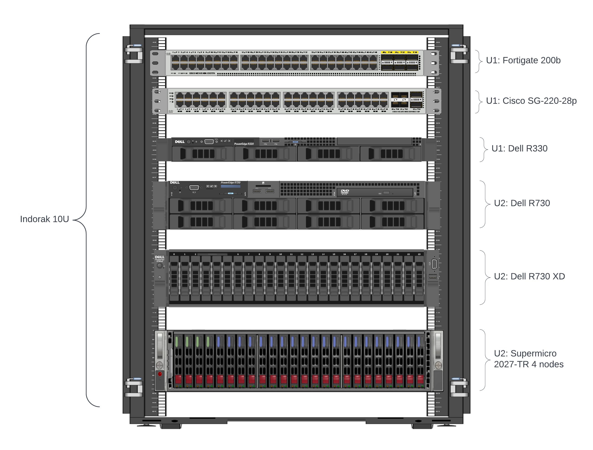

## Hardware Recommendation

Berikut adalah hardware rekomendasi untuk installasi Nutanix Community Edition (ce v2.0)

- Rack mounting
- Servers
    - `1` Nodes
    - `3` or `4` Nodes
- Networking

### Rack Mounting

Untuk mengimplementasikan tor (Top of Rack) switch and heavy workload of bottom.

sebagai case disini saya terdapat 2 network device yaitu 

- Fortigate FG200B sebagai router dan firewall
- Cisco SG220 sebagai l2 switch

Kemudian terdapat 4 servers yaitu

- Dell R330 sebagai baremetal system
- Dell R730 sebagai storage system
- Dell R730XD sebagai Nutanix 1 node
- Supermicro 2027-TR sebagai Nutanix 4 node