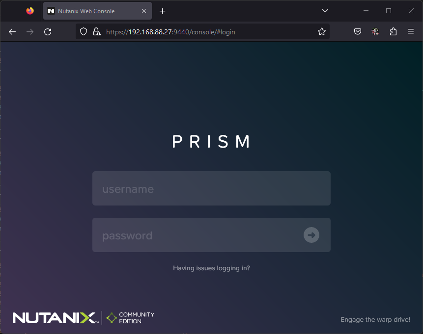
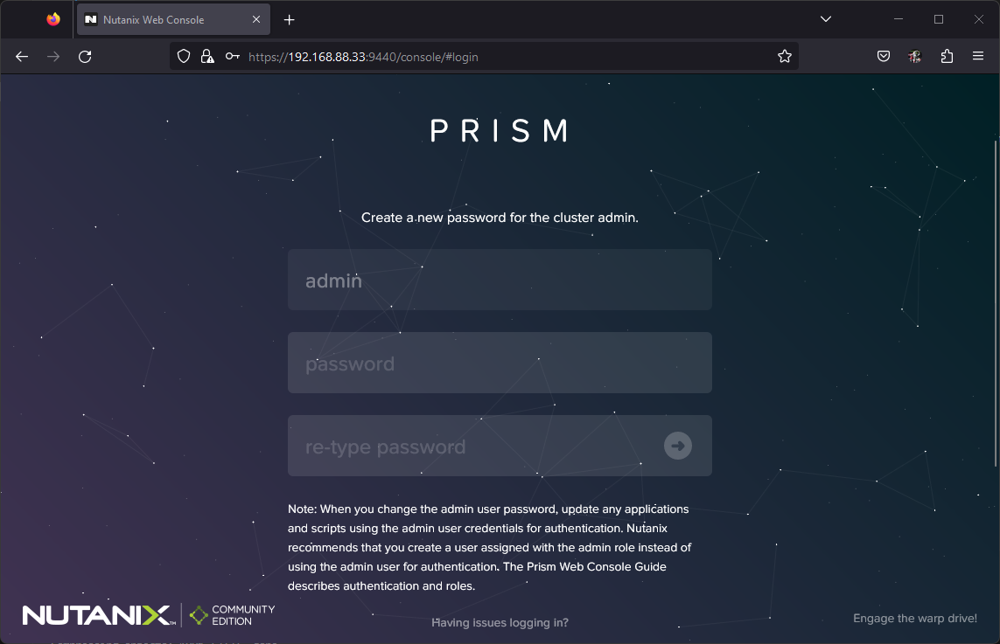
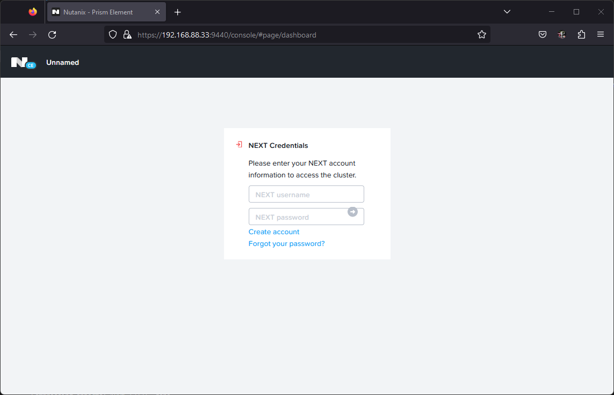
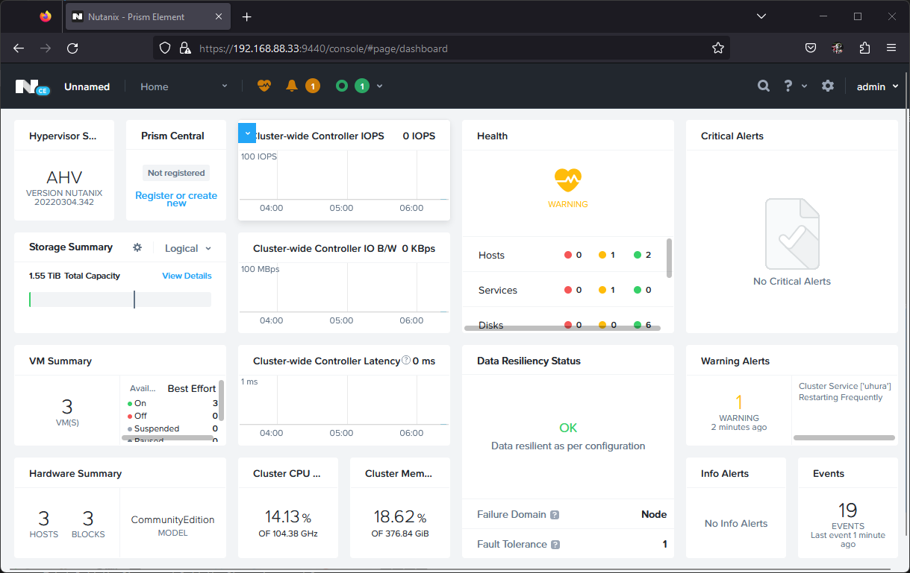
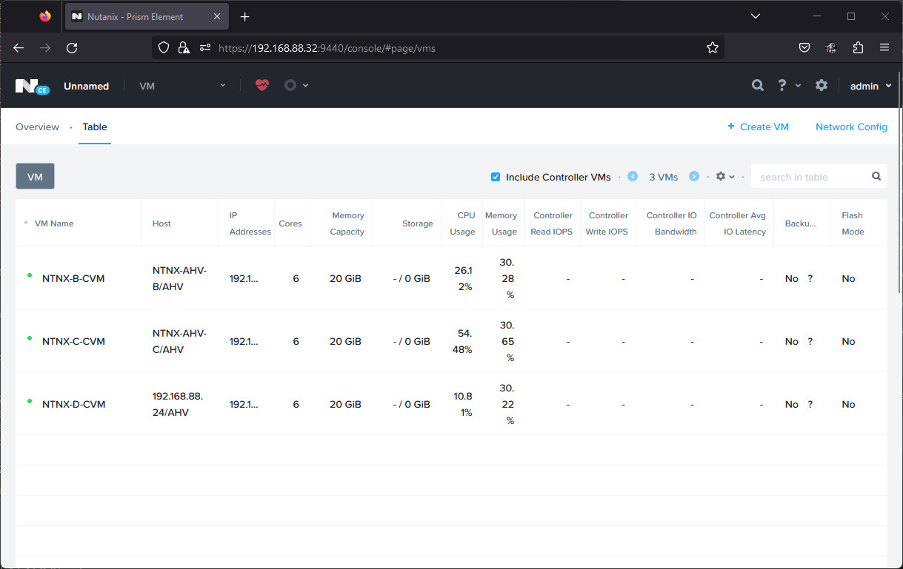
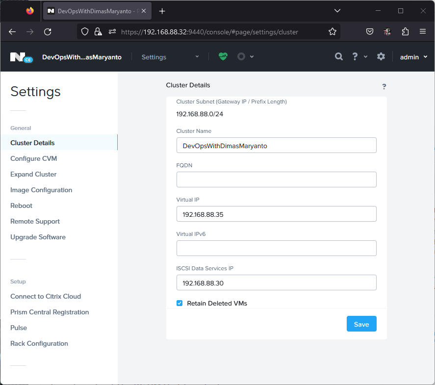
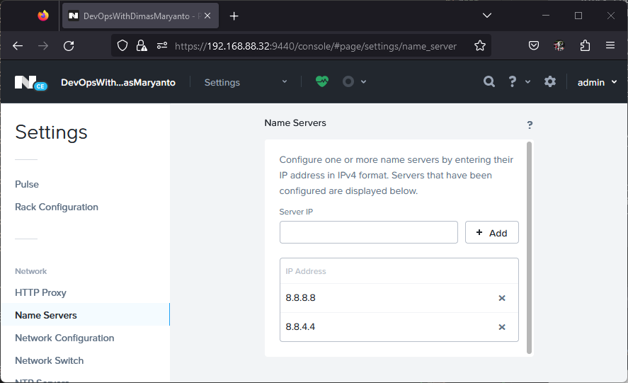
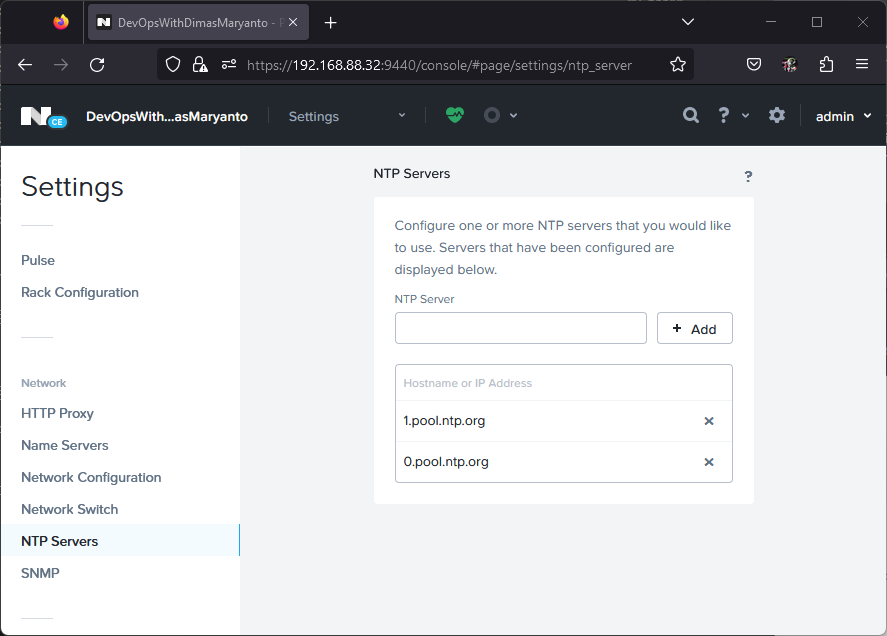
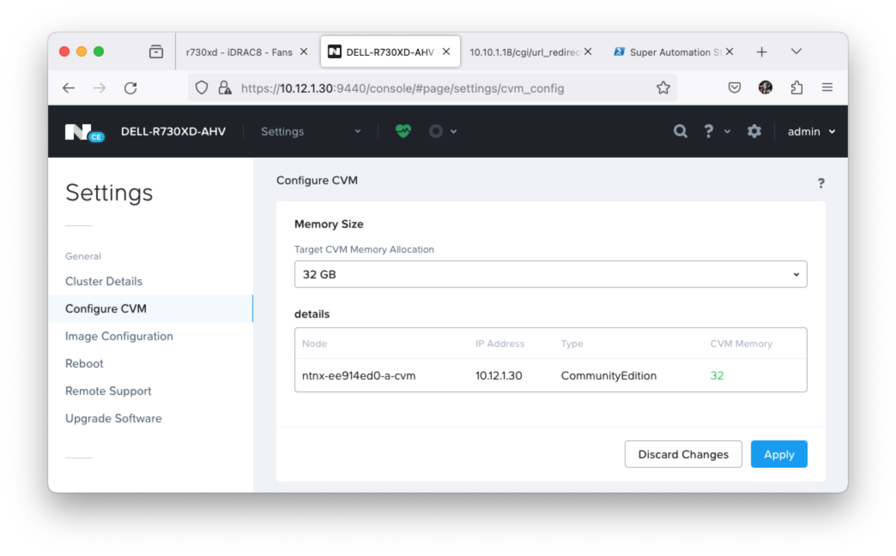

Setelah kita install Nutanix OS menggunakan bootdrive, 

## Create cluster

Setelah kita organize host dan cvm, sekarang kita bisa membuat cluster dengan perintah berikut:

```bash
cluster -s <cvm-ips> \
--redundancy_factor=<rep-factor> \
--cluster_name=<cluster-name> \
--container_name=<container-name> \
--ntp_servers=<ntp-servers> \
--dns_servers=<dns-servers> \
create

# cluster -s 10.12.1.30 --redundancy_factor=2 --cluster_name='DELL-R730XD-AHV' --container_name='default-storage' --ntp_servers='id.pool.ntp.org' --dns_servers='8.8.8.8' create
```

Jika dijalankan hasilnya seperti berikut:

```bash
nutanix@NTNX-9810330e-A-CVM:192.168.88.27:~$ cluster status
2023-08-25 02:07:45,107Z CRITICAL MainThread cluster:2930 Cluster is currently unconfigured. Please create the cluster.

nutanix@NTNX-ba60e5b2-A-CVM:10.12.1.30:~$ cluster -s 10.12.1.30 --redundancy_factor=2 --cluster_name='DELL-R730XD-AHV' --container_name='default-storage' --ntp_servers='id.pool.ntp.org' --dns_servers='8.8.8.8' create
2023-08-25 23:15:33,673Z INFO MainThread cluster:2943 Executing action create on SVMs 
2023-08-25 23:15:36,700Z INFO MainThread cluster:1007 Discovered node:
ip: 10.12.1.30
        rackable_unit_serial: ba60e5b2
        node_position: A
        node_uuid: 599cd71a-b97f-4a5f-8294-7787e5892888

2023-08-25 23:15:36,701Z INFO MainThread cluster:1025 Cluster is on arch x86_64
2023-08-25 23:15:36,701Z INFO MainThread genesis_utils.py:8077 Maximum node limit corresponding to the hypervisors on the cluster (set([u'kvm'])) : 32
2023-08-25 23:16:02,958Z INFO MainThread cluster:1396 Creating cluster with SVMs: 10.12.1.30
2023-08-25 23:16:03,147Z INFO MainThread cluster:1407 Will seed prism with password hash $6$Ej223/QPGNcQB$Pp1plB7W2.hxswYWiywajdfgS0YYBCyxa/fK7eDoy8FzaDpZFjdJZLprFpCY8O.Y0dpdBNP.XQWT12WvRWCAQ/
2023-08-25 23:16:57,925Z INFO MainThread cluster:1425 Zeus is not ready yet, trying again in 5 seconds
2023-08-25 23:17:35,895Z INFO MainThread cluster:1444 Waiting for services to start
Waiting on 10.12.1.30 (Up) to start:  SysStatCollector IkatProxy IkatControlPlane SSLTerminator SecureFileSync Medusa DynamicRingChanger Pithos InsightsDB Athena Mercury Mantle Stargate InsightsDataTransfer Ergon GoErgon Cerebro Chronos Curator Prism Hera CIM AlertManager Arithmos Catalog Acropolis Uhura NutanixGuestTools MinervaCVM ClusterConfig APLOSEngine APLOS PlacementSolver Lazan Polaris Delphi Security Flow Anduril XTrim ClusterHealth

The state of the cluster: start
Lockdown mode: Disabled

        CVM: 10.12.1.30 Up
                                Zeus   UP       [12935, 12983, 12984, 12985, 12994, 13012]
                           Scavenger   UP       [17030, 17210, 17211, 17212]
                              Xmount   UP       [17027, 17185, 17186, 17221]
                    SysStatCollector   UP       [19631, 19771, 19772, 19773]
                           IkatProxy   UP       [20756, 20879, 20880, 20881]
                    IkatControlPlane   UP       [21459, 21594, 21595, 21596]
                       SSLTerminator   UP       [21567, 21768, 21769]
                      SecureFileSync   UP       [21636, 21835, 21836, 21837]
                              Medusa   UP       [22682, 22836, 22837, 22919, 23361]
                  DynamicRingChanger   UP       [25151, 25257, 25258, 25295]
                              Pithos   UP       [25198, 25356, 25357, 25391]
                          InsightsDB   UP       [25270, 25528, 25529, 25546]
                              Athena   UP       [25386, 25618, 25619, 25620]
                             Mercury   UP       [25478, 25685, 25686, 25745]
                              Mantle   UP       [25630, 25867, 25868, 25880]
                          VipMonitor   UP       [26665, 26666, 26667, 26668, 26676]
                            Stargate   UP       [26974, 27094, 27095, 27127, 27132]
                InsightsDataTransfer   UP       [27634, 27778, 27779, 27780, 27781, 27782, 27783, 27784, 27785]
                               Ergon   UP       [27861, 27983, 27984, 27985]
                             GoErgon   UP       [27951, 28066, 28067, 28141]
                             Cerebro   UP       [28164, 28248, 28249, 28368]
                             Chronos   UP       [28254, 28356, 28357, 28374]
                             Curator   UP       [28313, 28535, 28536, 28599]
                               Prism   UP       [28499, 28643, 28644, 28733]
                                Hera   UP       [28575, 28805, 28806, 28807]
                                 CIM   UP       [28746, 28918, 28919, 28926, 28928]
                        AlertManager   UP       [28897, 29105, 29106, 29135]
                            Arithmos   UP       [28959, 29175, 29176, 29298]
                             Catalog   UP       [29318, 29462, 29463, 29466]
                           Acropolis   UP       [29717, 29885, 29886, 29887]
                               Uhura   UP       [29833, 30015, 30016, 30565]
                   NutanixGuestTools   UP       [29980, 30155, 30156, 30166, 30183]
                          MinervaCVM   UP       [30944, 31084, 31085, 31086, 31368]
                       ClusterConfig   UP       [31098, 31245, 31246, 31247]
                         APLOSEngine   UP       [31156, 31299, 31300, 31301]
                               APLOS   UP       [31497, 31609, 31610, 31611]
                     PlacementSolver   UP       [31551, 31671, 31672, 31673, 31697]
                               Lazan   UP       [31675, 31822, 31823, 31824]
                             Polaris   UP       [31746, 31927, 31928, 32005]
                              Delphi   UP       [31775, 32065, 32066, 32067, 32078]
                            Security   UP       [32023, 32614, 32615, 32617]
                                Flow   UP       [319, 320, 321, 331, 32101]
                             Anduril   UP       [595, 596, 597, 32452]
                               XTrim   UP       [591, 770, 771, 772]
                       ClusterHealth   UP       [660, 918, 919]
2023-08-25 23:21:29,740Z INFO MainThread cluster:1450 Running CE cluster post-create script
2023-08-25 23:21:29,745Z INFO MainThread cluster:3104 Success!
```

Kemudian, temen-temen bisa akses salah satu ip cvm dengan port 9440 untuk mengkases Prism Element seperti berikut:



Login menggunakan default credential yaitu user = `admin` dan password = `nutanix/4u`, setelah itu temen-temen akan diarahkan untuk mengganti password default tersebut seperti berikut:



Setelah itu temen-temen login dengan credential yang baru, dan setelah itu temen-temen login ke Nutanix NEXT account seperti berikut:



Pada mesin tersebut harus terkoneksi ke internet, supaya bisa login ke Nutanix Prism Element. Jika tidak bisa login, silahkan coba ganti password dengan click reset password pada account [my.nutanix.com](https://my.nutanix.com) jika berhasil maka outputnya seperti berikut:



## Organize nodes

selanjutnya adalah kita organize dulu setiap nodenya seperti setting hostname lain-lain: 

Setup hostname for easyies to identified/troubleshoot when you got hardware problem:
- changed hostname on host ip

Kurang lebih seperti berikut metricnya:

| IPMI          | Node name     | Host IP       | Hostname for HostIP   | CVM IP        | Hostname for CVM      |
| :---          | :---          | :---          | :---                  | :---          | :---                  |
| 10.10.1.13 | DELL-R730XD-A-AHV    | 10.12.1.20 | DELL-R730XD-A        | 10.12.1.30 | DELL-R730XD-A            |

Untuk mengganti hostname pada AHV Host/Hypervisor IP kita bisa menggunakan perintah berikut:

```bash
change_ahv_hostname --host_ip=<host-IP-address> --host_name=<new-host-name>

# change_ahv_hostname --host_ip=10.12.1.20 --host_name=DELL-R730XD-A
```

Jika kita eksekusi hasilnya seperti berikut:

```bash
nutanix@NTNX-ba60e5b2-A-CVM:10.12.1.30:~$ change_ahv_hostname --host_ip=10.12.1.20 --host_name=DELL-R730XD-A
2023-08-25 23:34:20,658Z INFO ahv_host_agent.py:230 Setting response time out None for host agent
2023-08-25 23:34:21,881Z INFO ahv_host_agent.py:741 Event listener thread started
2023-08-25 23:34:25,759Z INFO change_ahv_hostname:69 Host name is successfully updated
```

Setelah berhasil semuanya, kita bisa lihat vm name pada menu `VM -> tables` hasilnya seperti berikut:



## Setup Prism Element

Kemudian kita setup untuk Prism Element seperti:

1. Setup VirtualIP, iSCSI Data Services IP
2. Setup NTP
3. Update disk tier (optinal)
4. Update CVM memory
5. Update Host, CVM user linux

### Setup VirtualIP, iSCSI Data

Kemudian untuk setting Virtual IP, iSCSI Data Services IP bisa kita langsung edit seperti berikut:



Untuk memastikan cluster kita bisa connect ke internet, pastikan kita menambahkan dns google seperti `8.8.8.8, 8.8.4.4` di menu `Setting -> Name Servers` seperti berikut: 



Untuk memastikan sync timezone pada cluster, kita harus menambahkan NTP pada menu `Setting -> NTP Server` seperti berikut:



### Update disk tier (optinal)

Untuk meng-update disk tier kita bisa menggunakan perintah `ncli disk update` seperti berikut:

```bash
# check id of list disks
ncli disk list

# update tier by id -- for example: ncli disk update tier-name=SSD-SATA id='0006135a-3086-f58f-4cd0-c81f66ef483f::13'
ncli disk update tier-name=SSD-SATA id='<disk-id>'
```
### Update CVM memory

Update memory on CVM is importance, by default is `20 Gi` so we need update to `32 Gi` for faster startup all service, Seperti berikut:



### Update Host, CVM user linux

The an other importance think is update credential for user `root` for Host/AHV and `nutanix` user for CVM

First update the credential for AHV/Host using this command:

```bash
# login to host/ahv
passwd
```

Finaly update the credential for CVM using this command:

```bash
# login to cvm
sudo passwd nutanix
```