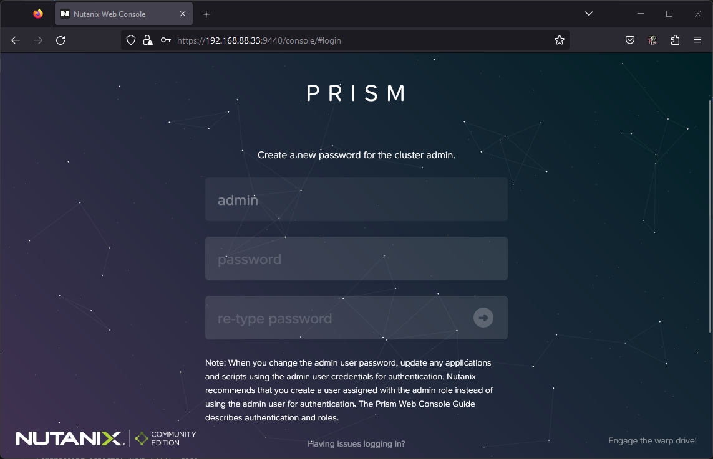
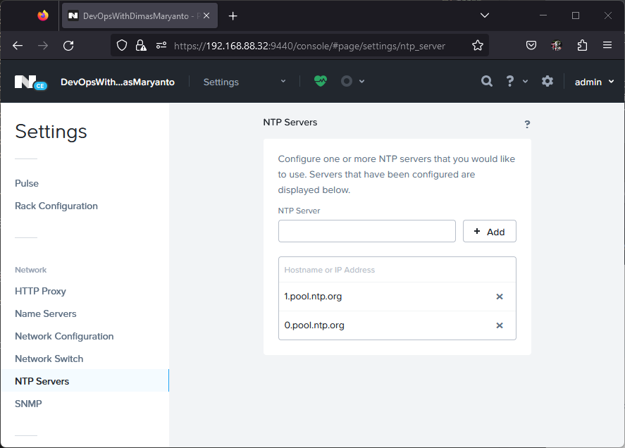

Setelah kita install Nutanix OS menggunakan bootdrive, 

## Create cluster

Setelah kita organize host dan cvm, sekarang kita bisa membuat cluster dengan perintah berikut:

```bash
cluster -s <cvm-ips> \
--redundancy_factor=<rep-factor> \
--cluster_name=<cluster-name> \
--container_name=<container-name> \
--ntp_servers=<ntp-servers> \
--dns_servers=<dns-servers> \
create

# cluster -s 10.12.1.31,10.12.1.32,10.12.1.33,10.12.1.34 --redundancy_factor=2 --cluster_name='Sys2027TR-H72RF-AHV' --container_name='default-storage' --ntp_servers='id.pool.ntp.org' --dns_servers='8.8.8.8' create
```

Jika dijalankan hasilnya seperti berikut:

```bash
nutanix@NTNX-9810330e-A-CVM:192.168.88.27:~$ cluster status
2023-08-25 02:07:45,107Z CRITICAL MainThread cluster:2930 Cluster is currently unconfigured. Please create the cluster.

nutanix@NTNX-ba60e5b2-A-CVM:192.168.88.32:~$ cluster -s 10.12.1.31,10.12.1.32,10.12.1.33,10.12.1.34 --redundancy_factor=2 --cluster_name='Sys2027TR-H72RF-AHV' --container_name='default-storage' --ntp_servers='id.pool.ntp.org' --dns_servers='8.8.8.8' create
2023-08-25 23:15:33,673Z INFO MainThread cluster:2943 Executing action create on SVMs 192.168.88.32,192.168.88.33,192.168.88.34
2023-08-25 23:15:36,700Z INFO MainThread cluster:1007 Discovered node:
ip: 192.168.88.32
        rackable_unit_serial: ba60e5b2
        node_position: A
        node_uuid: 599cd71a-b97f-4a5f-8294-7787e5892888

2023-08-25 23:15:36,701Z INFO MainThread cluster:1007 Discovered node:
ip: 192.168.88.33
        rackable_unit_serial: 9e7742d3
        node_position: A
        node_uuid: 0495d08d-3e7d-43bb-a785-4e5850c6b851

2023-08-25 23:15:36,701Z INFO MainThread cluster:1007 Discovered node:
ip: 192.168.88.34
        rackable_unit_serial: 350f3275
        node_position: A
        node_uuid: 3ebcaca5-1e34-4700-969e-824eec66dc88

2023-08-25 23:15:36,701Z INFO MainThread cluster:1025 Cluster is on arch x86_64
2023-08-25 23:15:36,701Z INFO MainThread genesis_utils.py:8077 Maximum node limit corresponding to the hypervisors on the cluster (set([u'kvm'])) : 32
2023-08-25 23:15:36,705Z INFO MainThread genesis_rack_utils.py:50 Rack not configured on node (svm_ip: 192.168.88.32)
2023-08-25 23:15:36,710Z INFO MainThread genesis_rack_utils.py:50 Rack not configured on node (svm_ip: 192.168.88.33)
2023-08-25 23:15:36,714Z INFO MainThread genesis_rack_utils.py:50 Rack not configured on node (svm_ip: 192.168.88.34)
2023-08-25 23:15:41,693Z INFO MainThread cluster:1332 iptables configured on SVM 192.168.88.32
2023-08-25 23:15:46,799Z INFO MainThread cluster:1332 iptables configured on SVM 192.168.88.33
2023-08-25 23:15:51,877Z INFO MainThread cluster:1332 iptables configured on SVM 192.168.88.34
2023-08-25 23:15:51,880Z INFO MainThread cluster:1351 Creating certificates
2023-08-25 23:15:56,715Z INFO MainThread cluster:1368 Setting the cluster functions on SVM node 192.168.88.32
2023-08-25 23:15:56,717Z INFO MainThread cluster:1373 Configuring Zeus mapping ({u'192.168.88.34': 3, u'192.168.88.33': 2, u'192.168.88.32': 1}) on SVM node 192.168.88.32
2023-08-25 23:15:58,254Z INFO MainThread cluster:1368 Setting the cluster functions on SVM node 192.168.88.33
2023-08-25 23:15:58,256Z INFO MainThread cluster:1373 Configuring Zeus mapping ({u'192.168.88.34': 3, u'192.168.88.33': 2, u'192.168.88.32': 1}) on SVM node 192.168.88.33
2023-08-25 23:16:00,615Z INFO MainThread cluster:1368 Setting the cluster functions on SVM node 192.168.88.34
2023-08-25 23:16:00,617Z INFO MainThread cluster:1373 Configuring Zeus mapping ({u'192.168.88.34': 3, u'192.168.88.33': 2, u'192.168.88.32': 1}) on SVM node 192.168.88.34
2023-08-25 23:16:02,958Z INFO MainThread cluster:1396 Creating cluster with SVMs: 192.168.88.32,192.168.88.33,192.168.88.34
2023-08-25 23:16:03,147Z INFO MainThread cluster:1407 Will seed prism with password hash $6$Ej223/QPGNcQB$Pp1plB7W2.hxswYWiywajdfgS0YYBCyxa/fK7eDoy8FzaDpZFjdJZLprFpCY8O.Y0dpdBNP.XQWT12WvRWCAQ/
2023-08-25 23:16:57,925Z INFO MainThread cluster:1425 Zeus is not ready yet, trying again in 5 seconds
2023-08-25 23:17:35,895Z INFO MainThread cluster:1444 Waiting for services to start
Waiting on 192.168.88.32 (Up) to start:  SysStatCollector IkatProxy IkatControlPlane SSLTerminator SecureFileSync Medusa DynamicRingChanger Pithos InsightsDB Athena Mercury Mantle Stargate InsightsDataTransfer Ergon GoErgon Cerebro Chronos Curator Prism Hera CIM AlertManager Arithmos Catalog Acropolis Uhura NutanixGuestTools MinervaCVM ClusterConfig APLOSEngine APLOS PlacementSolver Lazan Polaris Delphi Security Flow Anduril XTrim ClusterHealth
Waiting on 192.168.88.33 (Up) to start:  SysStatCollector IkatProxy IkatControlPlane SSLTerminator SecureFileSync Medusa DynamicRingChanger Pithos InsightsDB Athena Mercury Mantle Stargate InsightsDataTransfer Ergon GoErgon Cerebro Chronos Curator Prism Hera CIM AlertManager Arithmos Catalog Acropolis Uhura NutanixGuestTools MinervaCVM ClusterConfig APLOSEngine APLOS PlacementSolver Lazan Polaris Delphi Security Flow Anduril XTrim ClusterHealth
Waiting on 192.168.88.34 (Up, ZeusLeader) to start:  SysStatCollector IkatProxy IkatControlPlane SSLTerminator SecureFileSync Medusa DynamicRingChanger Pithos InsightsDB Athena Mercury Mantle Stargate InsightsDataTransfer Ergon GoErgon Cerebro Chronos Curator Prism Hera CIM AlertManager Arithmos Catalog Acropolis Uhura NutanixGuestTools MinervaCVM ClusterConfig APLOSEngine APLOS PlacementSolver Lazan Polaris Delphi Security Flow Anduril XTrim ClusterHealth

The state of the cluster: start
Lockdown mode: Disabled

        CVM: 192.168.88.33 Up
                                Zeus   UP       [12935, 12983, 12984, 12985, 12994, 13012]
                           Scavenger   UP       [17030, 17210, 17211, 17212]
                              Xmount   UP       [17027, 17185, 17186, 17221]
                    SysStatCollector   UP       [19631, 19771, 19772, 19773]
                           IkatProxy   UP       [20756, 20879, 20880, 20881]
                    IkatControlPlane   UP       [21459, 21594, 21595, 21596]
                       SSLTerminator   UP       [21567, 21768, 21769]
                      SecureFileSync   UP       [21636, 21835, 21836, 21837]
                              Medusa   UP       [22682, 22836, 22837, 22919, 23361]
                  DynamicRingChanger   UP       [25151, 25257, 25258, 25295]
                              Pithos   UP       [25198, 25356, 25357, 25391]
                          InsightsDB   UP       [25270, 25528, 25529, 25546]
                              Athena   UP       [25386, 25618, 25619, 25620]
                             Mercury   UP       [25478, 25685, 25686, 25745]
                              Mantle   UP       [25630, 25867, 25868, 25880]
                          VipMonitor   UP       [26665, 26666, 26667, 26668, 26676]
                            Stargate   UP       [26974, 27094, 27095, 27127, 27132]
                InsightsDataTransfer   UP       [27634, 27778, 27779, 27780, 27781, 27782, 27783, 27784, 27785]
                               Ergon   UP       [27861, 27983, 27984, 27985]
                             GoErgon   UP       [27951, 28066, 28067, 28141]
                             Cerebro   UP       [28164, 28248, 28249, 28368]
                             Chronos   UP       [28254, 28356, 28357, 28374]
                             Curator   UP       [28313, 28535, 28536, 28599]
                               Prism   UP       [28499, 28643, 28644, 28733]
                                Hera   UP       [28575, 28805, 28806, 28807]
                                 CIM   UP       [28746, 28918, 28919, 28926, 28928]
                        AlertManager   UP       [28897, 29105, 29106, 29135]
                            Arithmos   UP       [28959, 29175, 29176, 29298]
                             Catalog   UP       [29318, 29462, 29463, 29466]
                           Acropolis   UP       [29717, 29885, 29886, 29887]
                               Uhura   UP       [29833, 30015, 30016, 30565]
                   NutanixGuestTools   UP       [29980, 30155, 30156, 30166, 30183]
                          MinervaCVM   UP       [30944, 31084, 31085, 31086, 31368]
                       ClusterConfig   UP       [31098, 31245, 31246, 31247]
                         APLOSEngine   UP       [31156, 31299, 31300, 31301]
                               APLOS   UP       [31497, 31609, 31610, 31611]
                     PlacementSolver   UP       [31551, 31671, 31672, 31673, 31697]
                               Lazan   UP       [31675, 31822, 31823, 31824]
                             Polaris   UP       [31746, 31927, 31928, 32005]
                              Delphi   UP       [31775, 32065, 32066, 32067, 32078]
                            Security   UP       [32023, 32614, 32615, 32617]
                                Flow   UP       [319, 320, 321, 331, 32101]
                             Anduril   UP       [595, 596, 597, 32452]
                               XTrim   UP       [591, 770, 771, 772]
                       ClusterHealth   UP       [660, 918, 919]
2023-08-25 23:21:29,740Z INFO MainThread cluster:1450 Running CE cluster post-create script
2023-08-25 23:21:29,745Z INFO MainThread cluster:3104 Success!
```

Kemudian, temen-temen bisa akses salah satu ip cvm dengan port 9440 untuk mengkases Prism Element seperti berikut:


Login menggunakan default credential yaitu user = `admin` dan password = `nutanix/4u`, setelah itu temen-temen akan diarahkan untuk mengganti password default tersebut seperti berikut:



Setelah itu temen-temen login dengan credential yang baru, dan setelah itu temen-temen login ke Nutanix NEXT account seperti berikut:


Pada mesin tersebut harus terkoneksi ke internet, supaya bisa login ke Nutanix Prism Element. Jika tidak bisa login, silahkan coba ganti password dengan click reset password pada account [my.nutanix.com](https://my.nutanix.com) jika berhasil maka outputnya seperti berikut:


## Organize nodes

selanjutnya adalah kita organize dulu setiap nodenya seperti setting hostname lain-lain: 

Setup hostname for easyies to identified/troubleshoot when you got hardware problem:
- changed on host ip
- changed on cvm

Kurang lebih seperti berikut metricnya:

| IPMI          | Node name     | Host IP       | Hostname for HostIP   | CVM IP        | Hostname for CVM      |
| :---          | :---          | :---          | :---                  | :---          | :---                  |
| 10.10.1.16 | NTNX-A-CVM    | 10.12.1.21 | NTNX-NODE-B           | 10.12.1.31 | NTNX-CVM-B            |
| 10.10.1.17 | NTNX-B-CVM    | 10.12.1.22 | NTNX-NODE-C           | 10.12.1.32 | NTNX-CVM-C            |
| 10.10.1.18 | NTNX-C-CVM    | 10.12.1.23 | NTNX-NODE-D           | 10.12.1.33 | NTNX-CVM-D            |
| 10.10.1.19 | NTNX-D-CVM    | 10.12.1.24 | NTNX-NODE-D           | 10.12.1.34 | NTNX-CVM-D            |

Untuk mengganti Node Name pada CVM IP kita bisa menggunakan perintah berikut:

```bash
change_cvm_display_name --cvm_ip=<cvm-ip> --cvm_name=<cvm-display-name>

# change_cvm_display_name --cvm_ip=10.12.1.31 --cvm_name=NTNX-Sys2027TR-A-CVM
# change_cvm_display_name --cvm_ip=10.12.1.32 --cvm_name=NTNX-Sys2027TR-B-CVM
# change_cvm_display_name --cvm_ip=10.12.1.33 --cvm_name=NTNX-Sys2027TR-C-CVM
# change_cvm_display_name --cvm_ip=10.12.1.34 --cvm_name=NTNX-Sys2027TR-D-CVM
```

Jika kita exekusi hasilnya seperti berikut:

```bash
nutanix@NTNX-CVM-D:192.168.88.34:~$ change_cvm_display_name --cvm_ip=10.12.1.31 --cvm_name=NTNX-Sys2027TR-A-CVM
2023-08-26 00:16:22,135Z INFO change_cvm_display_name:207 Attempting to change the display name of the CVM
2023-08-26 00:16:22,136Z INFO zookeeper_session.py:191 change_cvm_display_name is attempting to connect to Zookeeper
2023-08-26 00:16:22,145Z INFO change_cvm_display_name:125 Retrieving the name of the CVM for the host
2023-08-26 00:16:22,147Z INFO zookeeper_session.py:625 ZK session establishment complete, sessionId=0x28a2f177ebb013e, negotiated timeout=20 secs
2023-08-26 00:16:22,706Z INFO change_cvm_display_name:156 Running prechecks before execution of script
2023-08-26 00:16:22,706Z INFO change_cvm_display_name:162 Running on AHV host
2023-08-26 00:16:22,707Z INFO change_cvm_display_name:168 Running on different CVM
2023-08-26 00:16:22,707Z INFO change_cvm_display_name:175 Display name is validated
Changing display name to NTNX-B-CVM. This will reboot the CVM. Do you want to proceed? (Y/N): Y
2023-08-26 00:16:26,901Z INFO change_cvm_display_name:248 Checking if shutdown token can be retrieved
2023-08-26 00:16:26,990Z INFO change_cvm_display_name:254 Shutting down CVM:192.168.88.32 for changing the display name
2023-08-26 00:16:57,533Z WARNING command.py:175 Timeout executing /usr/bin/ssh -q -o CheckHostIp=no -o ConnectTimeout=15 -o StrictHostKeyChecking=no -o TCPKeepAlive=yes -o UserKnownHostsFile=/dev/null -o ControlPath=/home/nutanix/.ssh/controlmasters/tmp__NS4L -o PreferredAuthentications=publickey  nutanix@192.168.88.32 source /etc/profile; /home/nutanix/cluster/bin/cvm_shutdown -h now: 30 secs elapsed
2023-08-26 00:18:57,957Z INFO change_cvm_display_name:196 Confirming if the CVM has been shut down
2023-08-26 00:18:58,120Z INFO change_cvm_display_name:263 CVM was shut down succesfully
2023-08-26 00:18:58,120Z INFO change_cvm_display_name:67 Running cmd: virsh domrename NTNX-ba60e5b2-A-CVM NTNX-B-CVM on host
2023-08-26 00:19:13,286Z INFO change_cvm_display_name:67 Running cmd: virsh start NTNX-B-CVM on host
2023-08-26 00:19:31,245Z INFO change_cvm_display_name:67 Running cmd: virsh autostart NTNX-B-CVM on host
2023-08-26 00:19:46,425Z INFO change_cvm_display_name:284 Attempting to create a backup of the NTNX-CVM.xml file on host
2023-08-26 00:19:46,527Z INFO change_cvm_display_name:103 Creating new CVM XML config file
2023-08-26 00:19:46,527Z INFO change_cvm_display_name:105 Running cmd: virsh dumpxml NTNX-B-CVM > NTNX-CVM.xml on host
2023-08-26 00:19:46,688Z INFO change_cvm_display_name:111 Successful in creating the XML file for the CVM.
2023-08-26 00:19:46,688Z INFO change_cvm_display_name:297 CVM rename successful
```

Untuk mengganti hostname pada AHV Host/Hypervisor IP kita bisa menggunakan perintah berikut:

```bash
change_ahv_hostname --host_ip=<host-IP-address> --host_name=<new-host-name>

# change_ahv_hostname --host_ip=10.12.1.21 --host_name=AHV-Sys2027TR-A
# change_ahv_hostname --host_ip=10.12.1.22 --host_name=AHV-Sys2027TR-B
# change_ahv_hostname --host_ip=10.12.1.23 --host_name=AHV-Sys2027TR-C
# change_ahv_hostname --host_ip=10.12.1.24 --host_name=AHV-Sys2027TR-D
```

Jika kita eksekusi hasilnya seperti berikut:

```bash
nutanix@NTNX-ba60e5b2-A-CVM:10.12.1.33:~$ change_ahv_hostname --host_ip=10.12.1.24 --host_name=AHV-Sys2027TR-D
2023-08-25 23:34:20,658Z INFO ahv_host_agent.py:230 Setting response time out None for host agent
2023-08-25 23:34:21,881Z INFO ahv_host_agent.py:741 Event listener thread started
2023-08-25 23:34:25,759Z INFO change_ahv_hostname:69 Host name is successfully updated
```

Setelah berhasil semuanya, kita bisa lihat vm name pada menu `VM -> tables` hasilnya seperti berikut:


## Setup Prism Element

Kemudian kita setup untuk Prism Element seperti:

1. Setup Virtual IP, iSCSI Data Services IP
2. Setup DNS
3. Setup NTP

### Setup Virtual IP, iSCSI Data Services IP

Untuk setting Virtual IP, iSCSI Data Services IP bisa kita langsung edit seperti berikut:


Untuk memastikan cluster kita bisa connect ke internet, pastikan kita menambahkan dns google seperti `8.8.8.8, 8.8.4.4` di menu `Setting -> Name Servers` seperti berikut: 


Untuk memastikan sync timezone pada cluster, kita harus menambahkan NTP pada menu `Setting -> NTP Server` seperti berikut:


