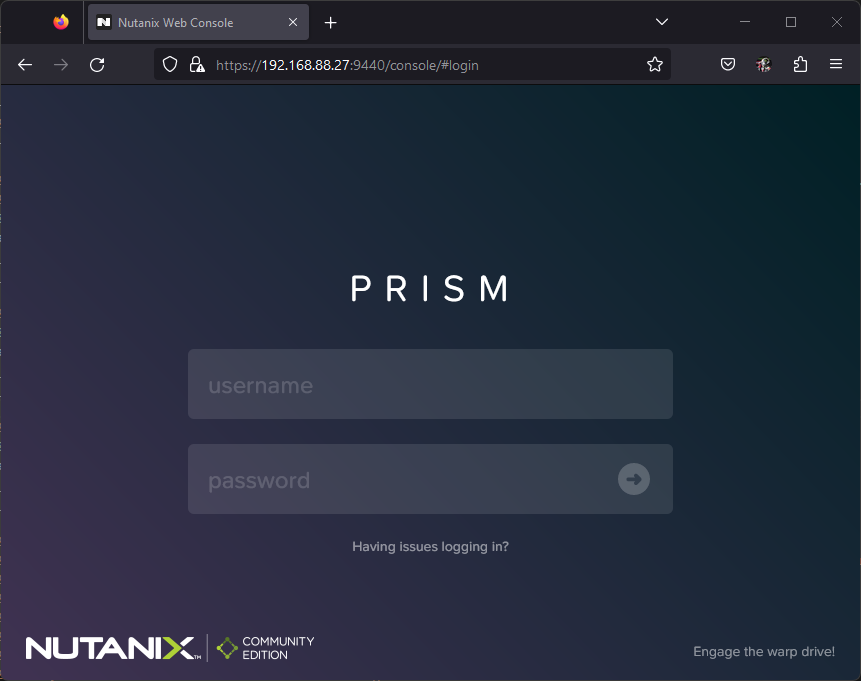

Setelah kita install Nutanix OS menggunakan bootdrive, 

## Create cluster

Setelah kita organize host dan cvm, sekarang kita bisa membuat cluster dengan perintah berikut:

```bash
cluster -s <cvm-ips> --redundancy_factor=<number-of-factor> create
```

Jika dijalankan hasilnya seperti berikut:

```bash
nutanix@NTNX-9810330e-A-CVM:192.168.88.27:~$ cluster status
2023-08-25 02:07:45,107Z CRITICAL MainThread cluster:2930 Cluster is currently unconfigured. Please create the cluster.

nutanix@NTNX-9810330e-A-CVM:192.168.88.27:~$ cluster -s 192.168.88.27,192.168.88.28,192.168.88.29 --redundancy_factor=2 create
2023-08-25 02:08:28,894Z INFO MainThread cluster:2943 Executing action create on SVMs 192.168.88.27,192.168.88.28,192.168.88.29
2023-08-25 02:08:31,915Z INFO MainThread cluster:1007 Discovered node:
ip: 192.168.88.29
        rackable_unit_serial: 33e7f46b
        node_position: A
        node_uuid: ac98447c-53fa-4ce5-a6b8-b0e86d61b918

2023-08-25 02:08:31,915Z INFO MainThread cluster:1007 Discovered node:
ip: 192.168.88.28
        rackable_unit_serial: a15d5117
        node_position: A
        node_uuid: 764679c6-ac96-4220-a7e4-3a9e94d7bb42

2023-08-25 02:08:31,916Z INFO MainThread cluster:1007 Discovered node:
ip: 192.168.88.27
        rackable_unit_serial: 9810330e
        node_position: A
        node_uuid: 6a187398-d296-45eb-9844-42d4edce5288

2023-08-25 02:08:31,916Z INFO MainThread cluster:1025 Cluster is on arch x86_64
2023-08-25 02:08:31,916Z INFO MainThread genesis_utils.py:8077 Maximum node limit corresponding to the hypervisors on the cluster (set([u'kvm'])) : 32
2023-08-25 02:08:31,920Z INFO MainThread genesis_rack_utils.py:50 Rack not configured on node (svm_ip: 192.168.88.27)
2023-08-25 02:08:31,925Z INFO MainThread genesis_rack_utils.py:50 Rack not configured on node (svm_ip: 192.168.88.28)
2023-08-25 02:08:31,929Z INFO MainThread genesis_rack_utils.py:50 Rack not configured on node (svm_ip: 192.168.88.29)
2023-08-25 02:08:41,770Z INFO MainThread cluster:1332 iptables configured on SVM 192.168.88.28
2023-08-25 02:08:46,667Z INFO MainThread cluster:1332 iptables configured on SVM 192.168.88.29
2023-08-25 02:08:46,670Z INFO MainThread cluster:1351 Creating certificates
2023-08-25 02:08:50,860Z INFO MainThread cluster:1368 Setting the cluster functions on SVM node 192.168.88.27
2023-08-25 02:08:50,861Z INFO MainThread cluster:1373 Configuring Zeus mapping ({u'192.168.88.27': 2, u'192.168.88.28': 1, u'192.168.88.29': 3}) on SVM node 192.168.88.27
2023-08-25 02:08:52,440Z INFO MainThread cluster:1368 Setting the cluster functions on SVM node 192.168.88.28
2023-08-25 02:08:52,443Z INFO MainThread cluster:1373 Configuring Zeus mapping ({u'192.168.88.27': 2, u'192.168.88.28': 1, u'192.168.88.29': 3}) on SVM node 192.168.88.28
2023-08-25 02:08:54,266Z INFO MainThread cluster:1368 Setting the cluster functions on SVM node 192.168.88.29
2023-08-25 02:08:54,269Z INFO MainThread cluster:1373 Configuring Zeus mapping ({u'192.168.88.27': 2, u'192.168.88.28': 1, u'192.168.88.29': 3}) on SVM node 192.168.88.29
2023-08-25 02:08:55,991Z INFO MainThread cluster:1396 Creating cluster with SVMs: 192.168.88.27,192.168.88.28,192.168.88.29
2023-08-25 02:08:56,152Z INFO MainThread cluster:1407 Will seed prism with password hash $6$Ej223/QPGNcQB$Pp1plB7W2.hxswYWiywajdfgS0YYBCyxa/fK7eDoy8FzaDpZFjdJZLprFpCY8O.Y0dpdBNP.XQWT12WvRWCAQ/
2023-08-25 02:09:52,273Z INFO MainThread cluster:1425 Zeus is not ready yet, trying again in 5 seconds
2023-08-25 02:10:29,013Z INFO MainThread cluster:1444 Waiting for services to start
Waiting on 192.168.88.27 (Up) to start:  SysStatCollector IkatProxy IkatControlPlane SSLTerminator SecureFileSync Medusa DynamicRingChanger Pithos InsightsDB Athena Mercury Mantle Stargate InsightsDataTransfer Ergon GoErgon Cerebro Chronos Curator Prism Hera CIM AlertManager Arithmos Catalog Acropolis Uhura NutanixGuestTools MinervaCVM ClusterConfig APLOSEngine APLOS PlacementSolver Lazan Polaris Delphi Security Flow Anduril XTrim ClusterHealth
Waiting on 192.168.88.28 (Up) to start:  SysStatCollector IkatProxy IkatControlPlane SSLTerminator SecureFileSync Medusa DynamicRingChanger Pithos InsightsDB Athena Mercury Mantle Stargate InsightsDataTransfer Ergon GoErgon Cerebro Chronos Curator Prism Hera CIM AlertManager Arithmos Catalog Acropolis Uhura NutanixGuestTools MinervaCVM ClusterConfig APLOSEngine APLOS PlacementSolver Lazan Polaris Delphi Security Flow Anduril XTrim ClusterHealth
Waiting on 192.168.88.29 (Up, ZeusLeader) to start:  SysStatCollector IkatProxy IkatControlPlane SSLTerminator SecureFileSync Medusa DynamicRingChanger Pithos InsightsDB Athena Mercury Mantle Stargate InsightsDataTransfer Ergon GoErgon Cerebro Chronos Curator Prism Hera CIM AlertManager Arithmos Catalog Acropolis Uhura NutanixGuestTools MinervaCVM ClusterConfig APLOSEngine APLOS PlacementSolver Lazan Polaris Delphi Security Flow Anduril XTrim ClusterHealth

The state of the cluster: start
Lockdown mode: Disabled

        CVM: 192.168.88.29 Up, ZeusLeader
                                Zeus   UP       [11395, 11443, 11444, 11445, 11454, 11472]
                           Scavenger   UP       [14719, 14908, 14909, 14910]
                              Xmount   UP       [14715, 14881, 14882, 14925]
                    SysStatCollector   UP       [17487, 17581, 17582, 17583]
                           IkatProxy   UP       [18527, 18635, 18636, 18637]
                    IkatControlPlane   UP       [19249, 19377, 19378, 19379]
                       SSLTerminator   UP       [19332, 19502, 19503]
                      SecureFileSync   UP       [19470, 19578, 19579, 19580]
                              Medusa   UP       [20507, 20635, 20636, 20672, 21182]
                  DynamicRingChanger   UP       [23819, 23973, 23974, 24010]
                              Pithos   UP       [23857, 24080, 24081, 24092]
                          InsightsDB   UP       [23900, 24187, 24189, 24223]
                              Athena   UP       [24048, 24302, 24303, 24304]
                             Mercury   UP       [24134, 24406, 24407, 24413]
                              Mantle   UP       [24313, 24546, 24547, 24562]
                          VipMonitor   UP       [25517, 25518, 25519, 25520, 25524]
                            Stargate   UP       [25522, 25691, 25692, 25718, 25719]
                InsightsDataTransfer   UP       [26168, 26289, 26290, 26295, 26296, 26297, 26298, 26299, 26300]
                               Ergon   UP       [26223, 26453, 26454, 26455, 26632]
                             GoErgon   UP       [26457, 26525, 26526, 26543]
                             Cerebro   UP       [26649, 26784, 26785, 26942]
                             Chronos   UP       [26720, 26861, 26862, 26890]
                             Curator   UP       [26751, 26935, 26936, 27074]
                               Prism   UP       [26904, 27161, 27162, 27188]
                                Hera   UP       [26964, 27225, 27226, 27227]
                                 CIM   UP       [27255, 27493, 27495, 27497, 27498]
                        AlertManager   UP       [27301, 27555, 27556, 27573]
                            Arithmos   UP       [27567, 27749, 27750, 27767]
                             Catalog   UP       [27774, 27966, 27967, 27968]
                           Acropolis   UP       [28306, 28386, 28387, 28388]
                               Uhura   UP       [28359, 28528, 28529, 29349]
                   NutanixGuestTools   UP       [28537, 28664, 28665, 28681, 28716]
                          MinervaCVM   UP       [29186, 29280, 29281, 29282, 29604]
                       ClusterConfig   UP       [29298, 29452, 29453, 29454, 29464]
                         APLOSEngine   UP       [29388, 29613, 29614, 29615]
                               APLOS   UP       [29876, 30003, 30004, 30005]
                     PlacementSolver   UP       [29938, 30056, 30057, 30058, 30072]
                               Lazan   UP       [29972, 30215, 30216, 30217]
                             Polaris   UP       [30145, 30304, 30305, 30345]
                              Delphi   UP       [30267, 30648, 30649, 30650, 30696]
                            Security   UP       [30411, 30689, 30690, 30692]
                                Flow   UP       [30704, 30933, 30934, 30936]
                             Anduril   UP       [30875, 31292, 31293, 31294]
                               XTrim   UP       [31263, 31689, 31690, 31691]
                       ClusterHealth   UP       [31707, 31964, 31965]
2023-08-25 02:14:26,524Z INFO MainThread cluster:1450 Running CE cluster post-create script
2023-08-25 02:14:26,530Z INFO MainThread cluster:3104 Success!
```

Kemudian, temen-temen bisa akses salah satu ip cvm dengan port 9440 untuk mengkases Prism Element seperti berikut:



## Organize nodes

selanjutnya adalah kita organize dulu setiap nodenya seperti setting hostname lain-lain: 

Setup hostname for easyies to identified/troubleshoot when you got hardware problem:
- changed on host ip
- changed on cvm

Kurang lebih seperti berikut metricnya:

| IPMI          | Node name     | Host IP       | Hostname for HostIP   | CVM IP        | Hostname for CVM      |
| :---          | :---          | :---          | :---                  | :---          | :---                  |
| 192.168.88.12 | Node B        | 192.168.88.22 | NTNX-NODE-B           | 192.168.88.27 | NTNX-CVM-B            |
| 192.168.88.13 | Node C        | 192.168.88.22 | NTNX-NODE-C           | 192.168.88.27 | NTNX-CVM-C            |
| 192.168.88.14 | Node D        | 192.168.88.22 | NTNX-NODE-D           | 192.168.88.27 | NTNX-CVM-D            |

Untuk mengganti hostname pada AHV Host/Hypervisor IP kita bisa menggunakan perintah berikut:

```bash
change_ahv_hostname --host_ip=<host-IP-address> --host_name=<new-host-name>
```

Untu mengganti hostname pada CVM kita bisa menggunakan perintah berikut:

```bash
change_cvm_display_name --cvm_ip=<CVM-IP> --cvm_name=<new-name>
```

## Setup Prism Element