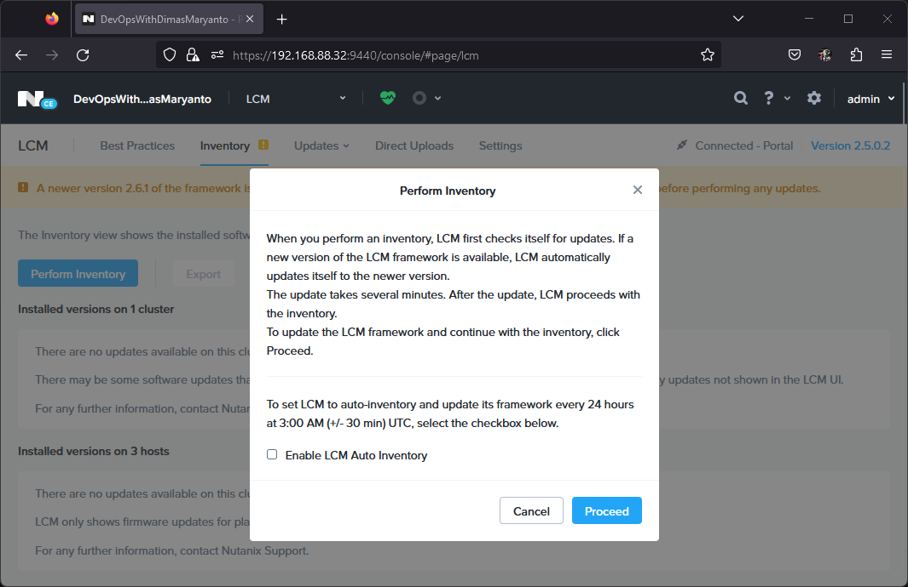
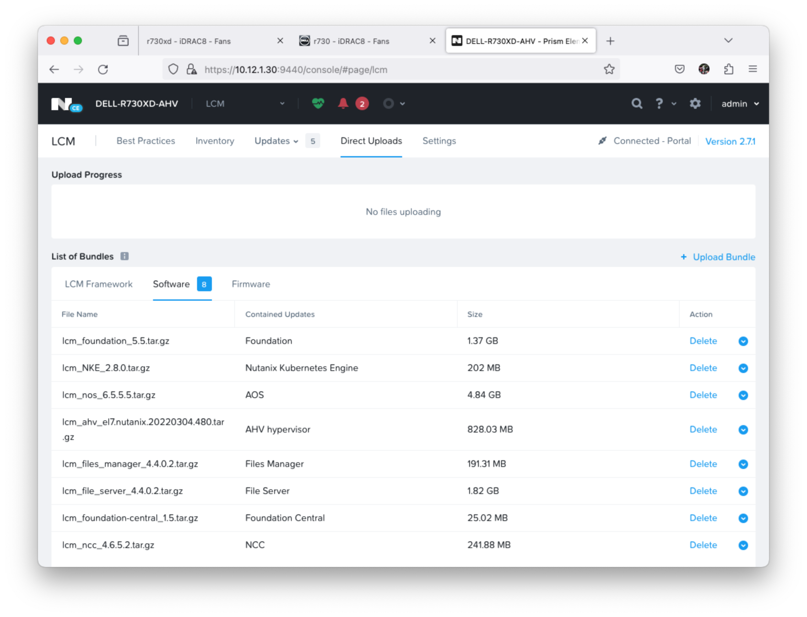
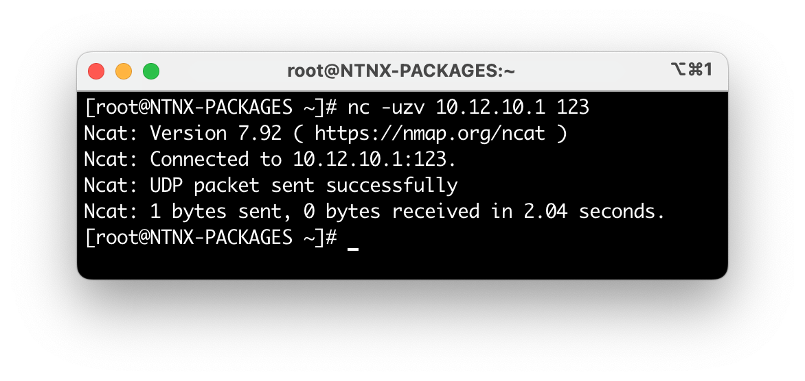
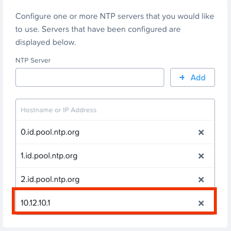
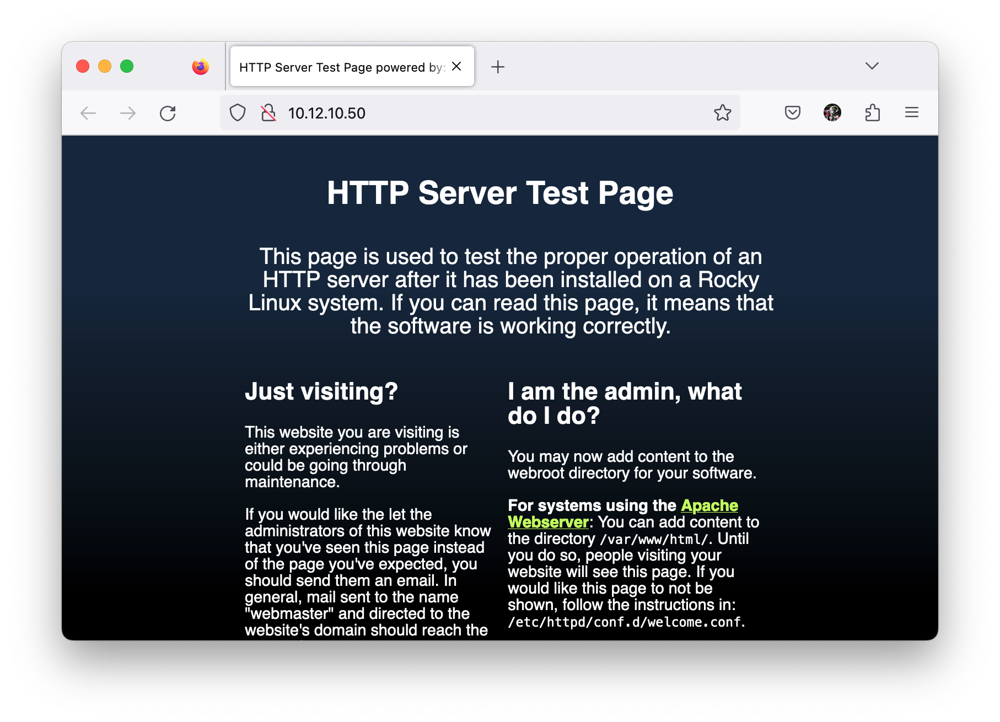

## Post Instal Nutanix Cluster

Ada beberapa operational yang perlu kita lakukan setelah install nutanix cluster, seperti berikut:

1. Lakukan update software dengan menggunakan Menu LCM pada Prism Element
2. Deploy Prism Central
3. Register Prism Central to Prism Element
4. Lakukan update software dengan menggunakan Menu LCM pada Prism Central

## LCM update software

Setelah cluster nutanix di configure, tahap selanjutnya adalah melakukan update software. Pertama kita lakukan Inventory terlebih dahulu pada menu LCM seperti berikut:



Setelah selesai, kita download component yang dibutuhkan dari Nutanix Portal kemudian ke Menu **Direct Uploads** upload semua component seperti berikut:



Dan lakkukan update pada tab Software.

## Deploy Prism Central

Download **Prism Central 1-click deploy from Prism Element** dari Nutanix portal [downloads page](https://portal.nutanix.com/page/downloads?product=prism) dengan version yang sesuai/compatible dengan Prism Element dalam case ini saya menggunakan AOS `6.5.x` maka menggunakan Prism Central `pc.2022.6.xx`


Setelah di download, kita balik lagi ke menu Prism Element pada cluster kita. Kita perlu buat dulu Network/Subnet infterfacenya.

## NTP Server (offsite)

Siapkan Physical/Virtual machine yang akan dipasangkan untuk mirror NTP Server secara offline.

Sebagai contoh disini saya sudah menyiapkan VM dengan specifikasi seperti berikut:

```yaml
VM: 
    os: Oracle Linux v9.3
    vcpu: 2 cores
    memory: 4 GB
    storage: 
        size: 20 GB
        partision:
            lvm:
                /: 20 Gb
                swap: 4 Gb
    network:
        gateway: 10.12.10.254
        ip: 10.12.10.1
```

Kemudian kita install package ntp server dengan perintah berikut:

```bash
dnf update -y && \
dnf install chrony nc && \
systemctl enable --now chronyd && \
firewall-cmd --permanent --add-service=ntp && \
firewall-cmd --reload
```

Set Chrony to act as an NTP server for a local network. To turn Chrony into an NTP server add the following line into the main Chrony `/etc/chrony.conf` configuration file:

```conf
# Use public servers change me
pool id.pool.ntp.org iburst

allow 10.12.0.0/24
# add an other subnet you want to allow
```

Kemudian kita restart service `chronyd` dengan perintah berikut:

```bash
systemctl restart chronyd
```

To verify connection to UDP port 123;

```bash
nc -uzv 10.12.10.1 123
```

The output look like this:



Setelah itu kita set NTP Server pada Prism Central pada menu `Setting -> NTP Servers` dengan menambahkan ip server yang telah kita setup seperti berikut:



## Darksite webserver (offline LCM)

Siapkan Physical/Virtual machine yang akan dipasangkan untuk webserver untuk menyimpan binary seperti release, image, patch dan lain-lain sehinga proses download dari internet di gantikan ke mekanisme ini.

Sebagai contoh disini saya sudah menyiapkan VM dengan specifikasi seperti berikut:

```yaml
VM: 
    os: Oracle Linux v9.3
    vcpu: 2 cores
    memory: 4 GB
    storage: 
        size: 100 GB
        partision:
            lvm:
                /: 95 Gb
                swap: 4 Gb
    network:
        gateway: 10.12.10.254
        ip: 10.12.10.2
```

Kemudian kita install package httpd dengan perintah berikut:

```bash
yum update && \
yum install -y httpd && \
systemctl enable --now httpd && \
firewall-cmd --zone=public --add-port=80/tcp --permanent && \
firewall-cmd --reload
```

Maka hasilnya seperti berikut:

