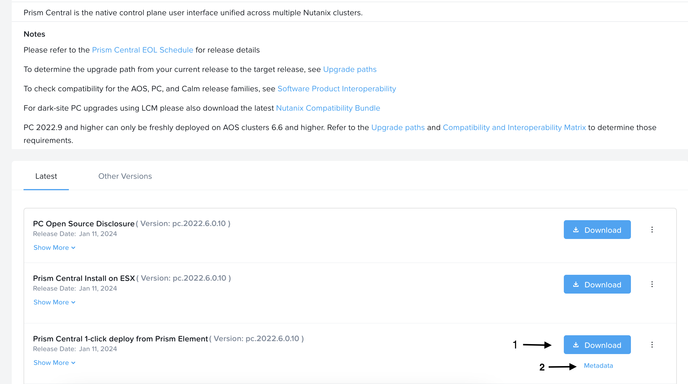
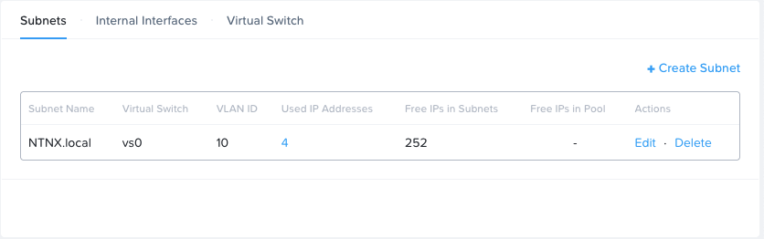

## Deploy Prism Central

Download **Prism Central 1-click deploy from Prism Element** dari Nutanix portal [downloads page](https://portal.nutanix.com/page/downloads?product=prism) dengan version yang sesuai/compatible dengan Prism Element dalam case ini saya menggunakan AOS `6.5.x` maka menggunakan Prism Central `pc.2022.6.xx`



Setelah di download, kita balik lagi ke menu Prism Element. 

Kita perlu buat dulu Network/Subnet infterfacenya, Untuk subnet Prism Central perlu dipisahkan dengan Prism Element dalam case kali ini saya menggunakan specifikasi seperti berikut:

```yaml
subnetName: NTNX.local
virtualSwitch: vs0
vlanID: 10
ipAddressManagement:
    enabled: true
    networkIPPrefix: 10.12.10.0/24
    gatewayIpAddress: 10.12.10.254
dhcpSetttings:
    domainNameServers: [8.8.8.8, 8.8.4.4]
ipAddressPools: []
```

Hasilnya seperti berikut:




## Update Cluster Name

Untuk mengupdate Cluster Name pada Prism central, kita bisa menggunakan command berikut:

```bash
ncli cluster edit-info new-name=NewPCName

# ncli cluster edit-info new-name='DevOpsWithDimas'
```