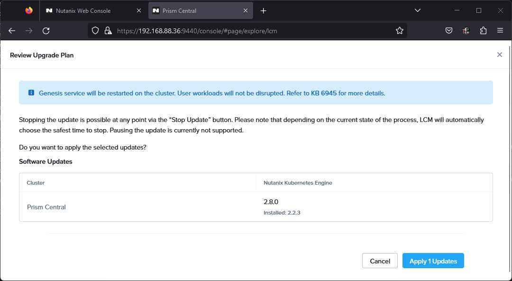
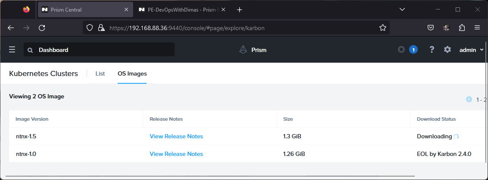

To enable Nutanix Kubernetes Engine (NKE), we have serveral options such as

- Online installation
- Offline installation

## Enable Nutanix Kubernetes Engine

Nutanix Kubernetes requirement **Prism Central** dengan version `2022.6.x.x` atau lebih baru. Setelah kita deploy prism central temen-temen bisa enable servicenya NKE di menu -> Services -> Karbon / Kubernetes seperti berikut:


Kemudian kita click **Enable Karbon** tunggu hinga seleasi, by default NKE version adalah `2.2.x` 


kita perlu update dulu engine NKE tersebut dengan menggunakan LCM ke version terbaru, saat ini version terbaru adalah `2.8.0`

1. Lakukan inventory scanning

    

2. Pre-check, plan

    
    
    

3. Nutanix Kubernetes Engine component

    

Tahap selanjutnya adalah download OS image

## Download OS image online method

Untuk method online method kita cukup ke menu -> services -> Kubernetes -> OS Image kemudian download yang terbaru, dalam hal ini saya menggunakan `ntnx-1.5` seperti berikut.




## Offline installation

For Offline installation, litle bit tricky here is how we do enable Nutanix Kubernetes Engine (NKE)

- Create darksite (webserver)
- Download binary airgap from nutanix portal support
- Extract `airgap.tgz` and `airgap-manifest.json` file to your site
- Deploying airgap
- Create kubernetes cluster

### Create darksite using `httpd`

Siapkan Physical/Virtual machine yang akan dipasangkan untuk webserver untuk menyimpan binary seperti release, image, patch dan lain-lain sehinga proses download dari internet di gantikan ke mekanisme ini.

Sebagai contoh disini saya sudah menyiapkan VM dengan specifikasi seperti berikut:

```yaml
VM: 
    os: RockyLinux v9.1
    vcpu: 2 cores
    memory: 4 GB
    storage: 
        size: 50 GB
        partision:
            lvm:
                /: 40 Gb
                swap: 4 Gb
    network:
        gateway: 10.12.10.254
        ip: 10.12.10.50
```

Kemudian kita install package httpd dengan perintah berikut:

```bash
yum update && \
yum install -y httpd && \
systemctl enable --now httpd && \
firewall-cmd --zone=public --add-port=80/tcp --permanent && \
firewall-cmd --reload
```

Maka hasilnya seperti berikut:

