To enable Nutanix Kubernetes Engine (NKE), we have serveral options:

- Online installation
- Offline installation

## Enable Nutanix Kubernetes Engine

Nutanix Kubernetes requirement **Prism Central** dengan version `2022.6.x.x` atau lebih baru. Setelah kita deploy prism central temen-temen bisa enable servicenya NKE di menu -> Services -> Karbon / Kubernetes seperti berikut:

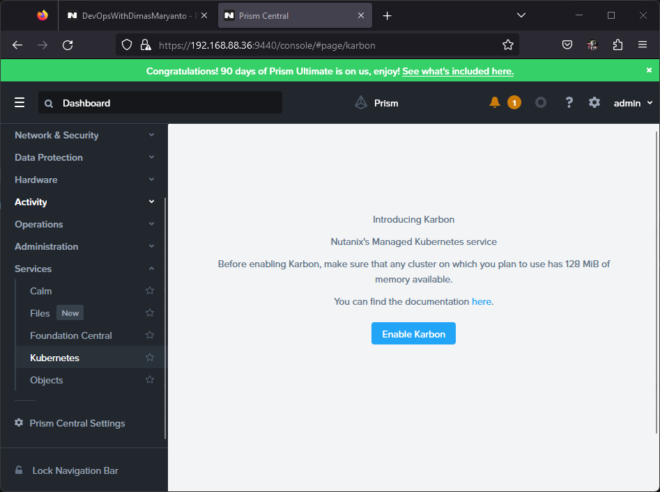

Kemudian kita click **Enable Karbon** tunggu hinga seleasi, by default NKE version adalah `2.2.x` 

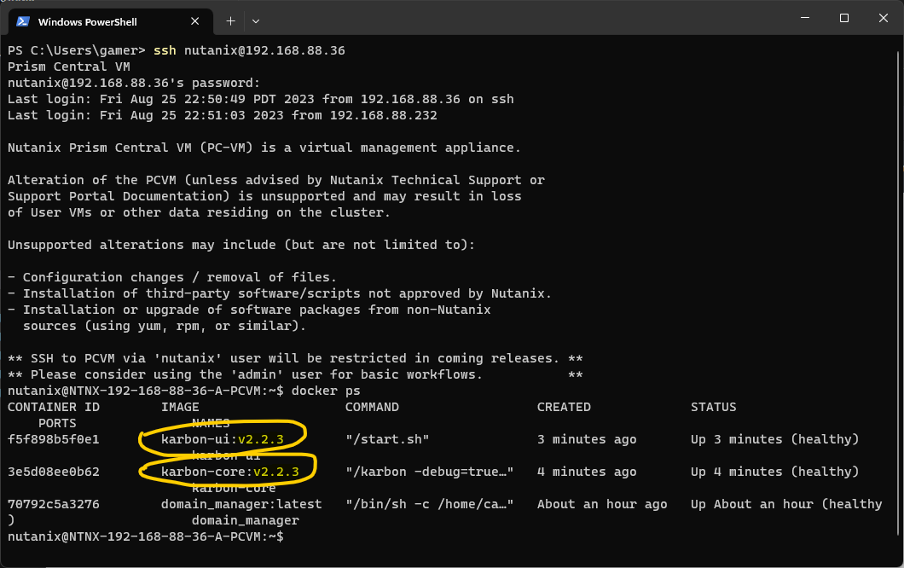

kita perlu update dulu engine NKE tersebut dengan menggunakan LCM ke version terbaru, saat ini version terbaru adalah `2.8.0`

1. Lakukan inventory scanning

    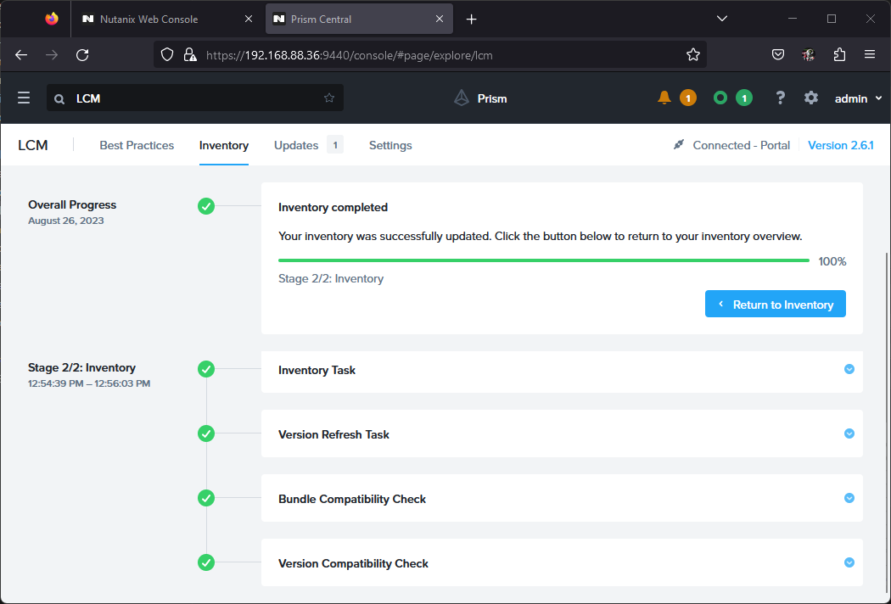

2. Pre-check, plan

    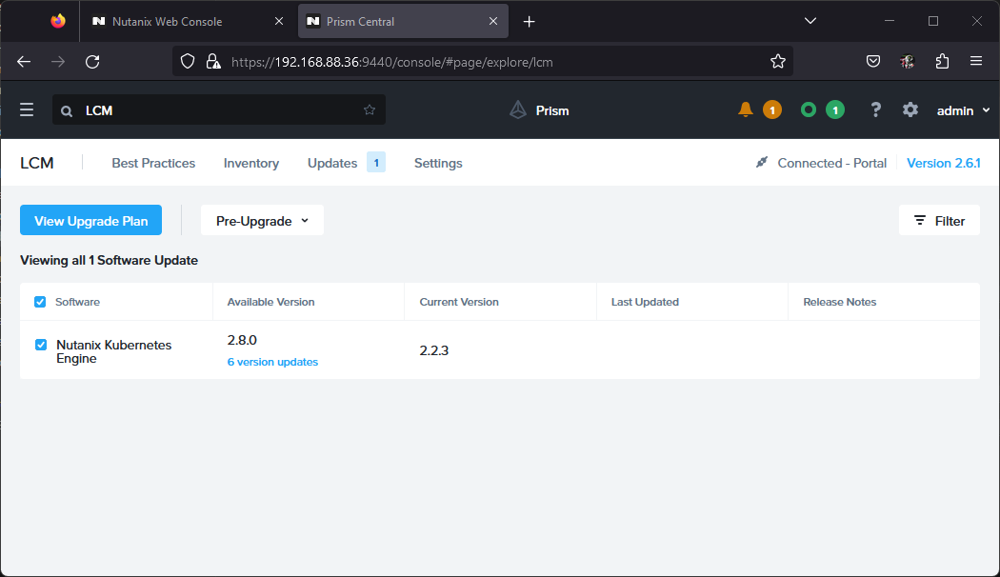
    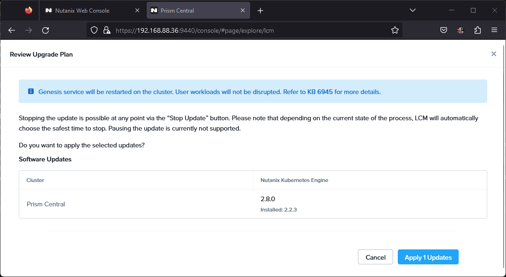
    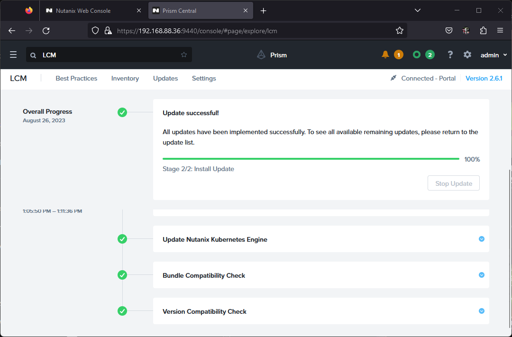

3. Nutanix Kubernetes Engine component

    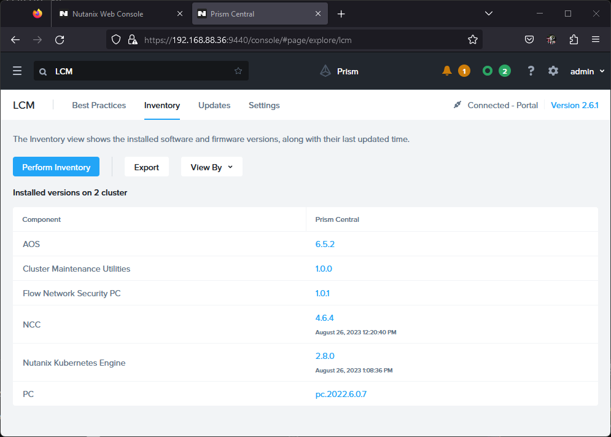

Tahap selanjutnya adalah download OS image

## Download OS image online method

Untuk method online method kita cukup ke menu -> services -> Kubernetes -> OS Image kemudian download yang terbaru, dalam hal ini saya menggunakan `ntnx-1.5` seperti berikut.

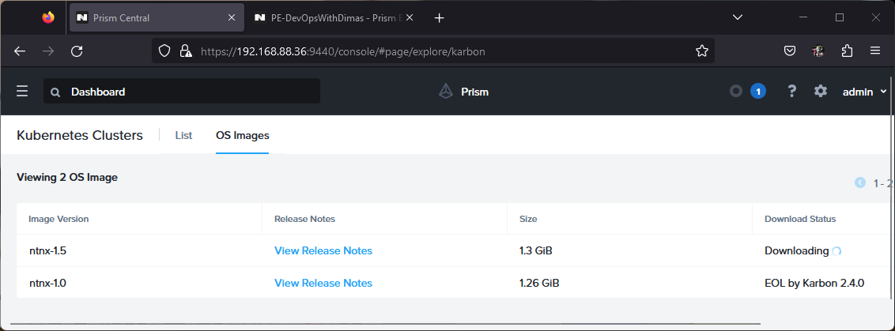

Setelah image terdownload, kita bisa buat kubernetes clusternya

## Download OS image offline method

For Offline installation, litle bit tricky here is how we do enable Nutanix Kubernetes Engine (NKE)

- Create darksite (webserver)
- Download binary airgap from [nutanix portal support](https://portal.nutanix.com/page/downloads?product=karbon)
    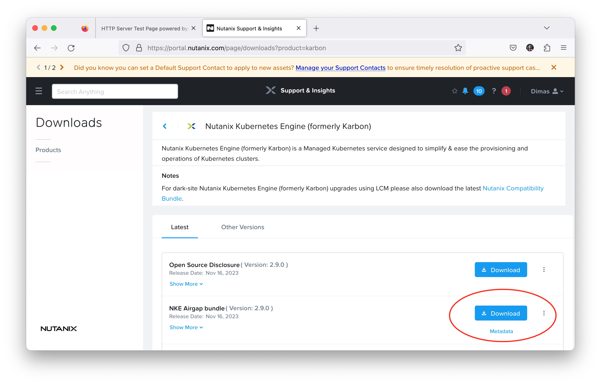

- Extract `airgap.tgz` and `airgap-manifest.json` file to your site
- Deploying airgap

### Extract `airgap-package.tgz`

Setelah kita download package `airgap-ntnx-x.x.x.tgz` selanjutnya kita upload ke web server tersebut dengan menggunakan perintah:

```bash
scp path-download/* admin@10.12.10.1:~/
```

Kemudian kita extract menggunakan perintah:

```bash
export AIRGAP_VERSION=2.8.0
## create folder and give it access to write
sudo mkdir -p /var/www/html/release/nke/$AIRGAP_VERSION && \
sudo chmod -R 777 /var/www/html/**

## extrat to folder target
tar xvf airgap-ntnx-$AIRGAP_VERSION.tar.gz -C /var/www/html/release/nke/$AIRGAP_VERSION/
cp airgap-manifest.json /var/www/html/release/nke/$AIRGAP_VERSION/
```

Sekarang kita bisa akses webappnya dengan url berikut 
[http://10.12.10.1/release/nke/2.8.0]()

Maka outputnya seperti berikut:

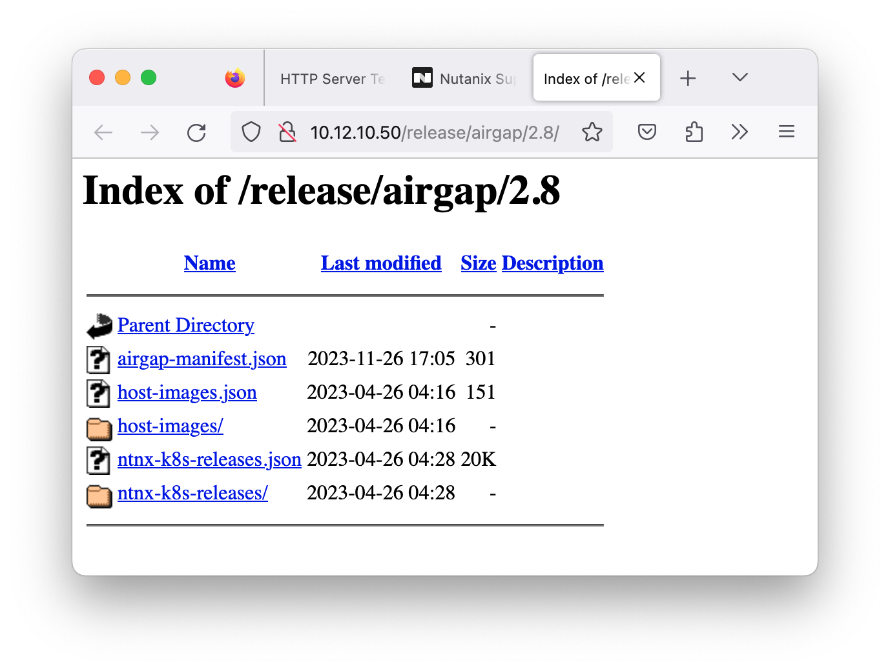

### Deploying airgap

Untuk mendeploy airgap, kita perlu login menggunakan ssh ke Prism Central mengunakan user `nutanix` seperti berikut:

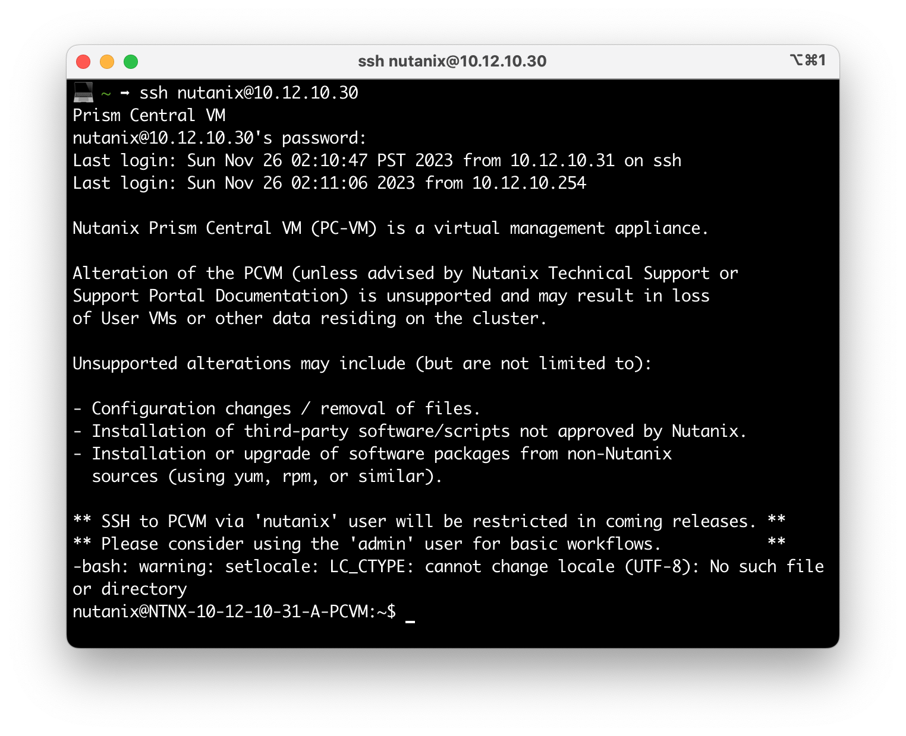

Kemudian kita menggunakan tools `karbonctl` yang terletak di folder `karbon`

Pertama kita login dulu menggunakan perintah:

```bash
./karbon/karbonctl login --pc-username admin
```

Input password untuk user `admin` pada Web Prism Central, jika berhasil outputnya seperti berikut:

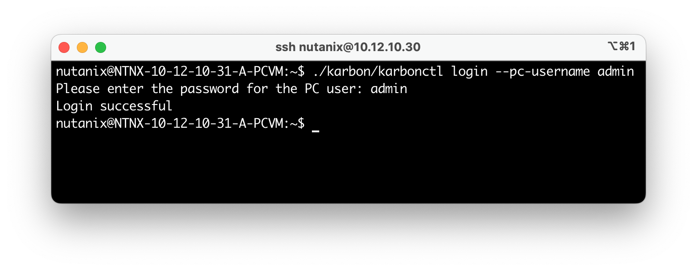

Setelah itu kita siapkan dulu pre-requisites untuk deploy airgap seperti berikut:

- Networking: 
    - `--vlan-name` atau `--vlan-uuid` bisa diambil dari Prism Element di menu Setting -> Network Configuration seperti berikut:
        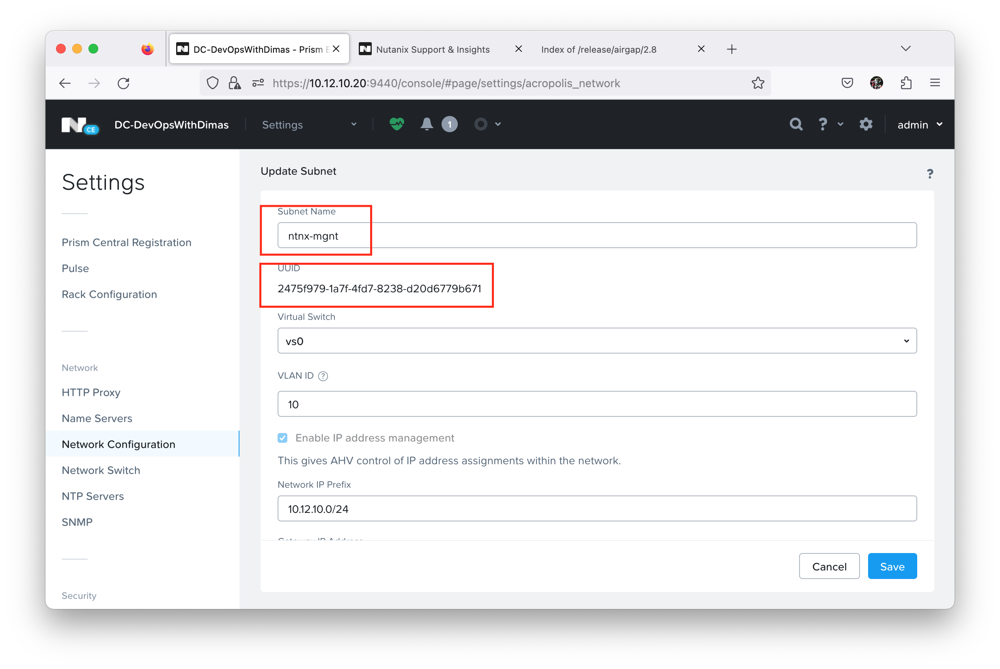
    - `--static-ip` kita bisa tentukan ip untuk vm airgapnya mau dipasang brapa?
- Cluster:
    - `--pe-cluster-name` atau `--pe-cluster-uuid` bisa ambil di Prism Element pada menu Setting -> Cluster Detail seperti berikut:
        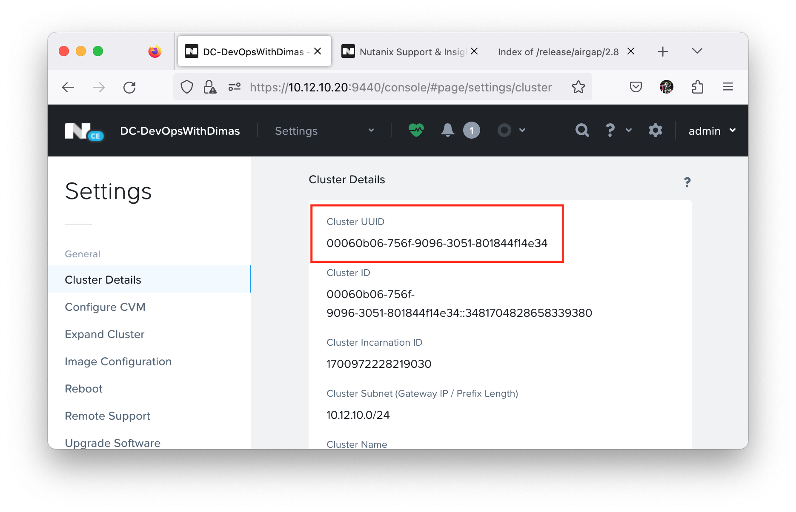
- Storage:
    - `--storage-container` bisa ambil dari Prism Element pada menu -> Storage -> Storage Container seperti berikut:
        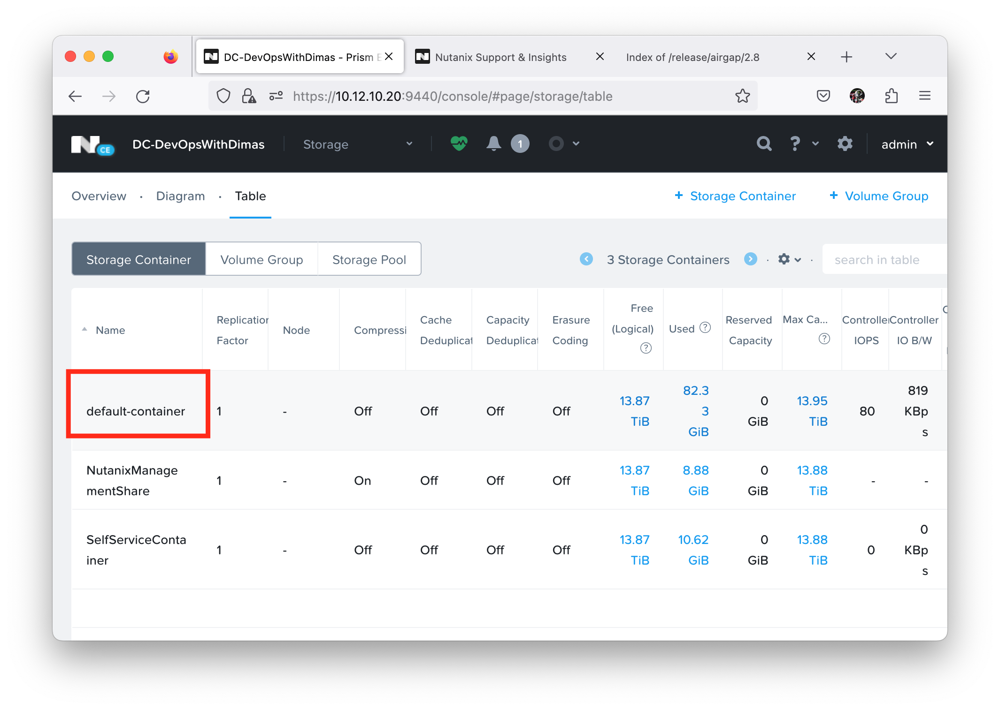
- Darksite config:
    - `--webserver-url` kita arahkan ke webserver yang udah kita siapkan sebelumnya

Ok pre-requisite sudah terpenuhi semua sekarang kita enable airgap dengan perintah berikut:

```bash
# export PRISM_USERNAME=admin
# export PRIMS_CLUSTER_UUID='<prism-cluster-uuid>'
# export NET_VLAN_UUID='<cluster-uuid>'
# export NET_STATIC_IP='10.12.10.51'
# export STORAGE_CONTAINER_NAME='default-container'
# export DARKSITE_URL='http://10.12.10.50/release/airgap/2.8.0/'

./karbon/karbonctl airgap \
--pe-username='admin' \
--vlan-uuid='<network-vlan-uuid>' \
--pe-cluster-uuid='<prism-cluster-uuid>' \
--static-ip='10.12.10.2' \
--storage-container='default-container' \
--webserver-url='http://10.12.10.1/release/nke/2.8.0/' \
enable
```

Maka hasilnya seperti berikut:

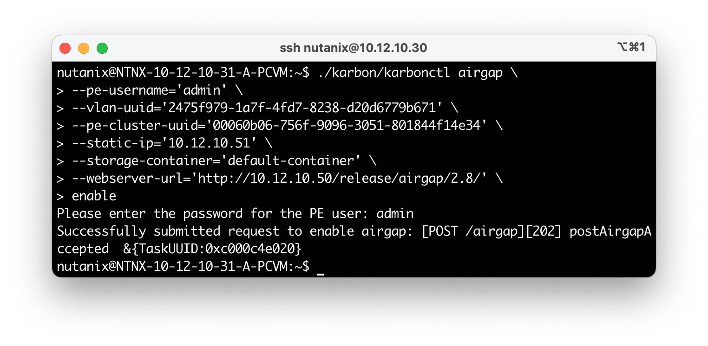

Kemudian kita bisa check airgapnya sudah di success terdeploy dengan perintah berikut:

```bash
./karbon/karbonctl airgap list
```

Maka hasilnya seperti berikut:

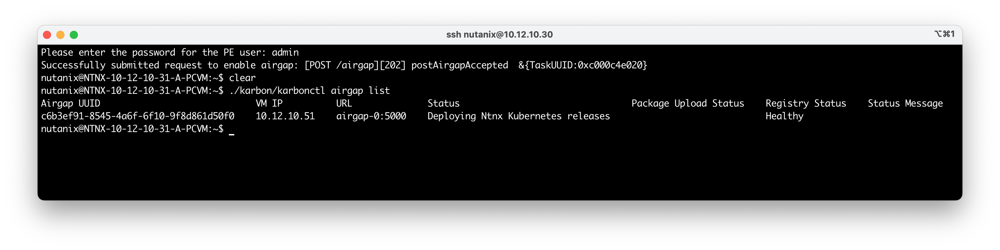