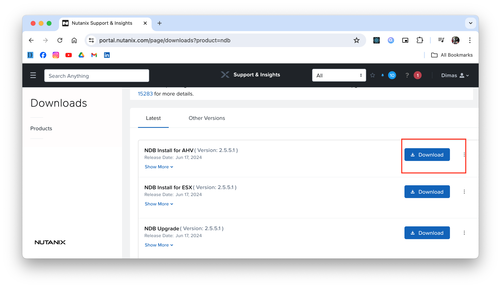

## Enable NDB Server

Requirement to enable Nutanix Database Server (NDB) formally ERA:

- Nutanix Prism
- `NDB-Server.qcow2` disk image, download from [Nutanix Support Download](https://portal.nutanix.com/page/downloads?product=ndb)
    
- Deploy NDB-Server as VM from Prism Element
- Setup & Configure