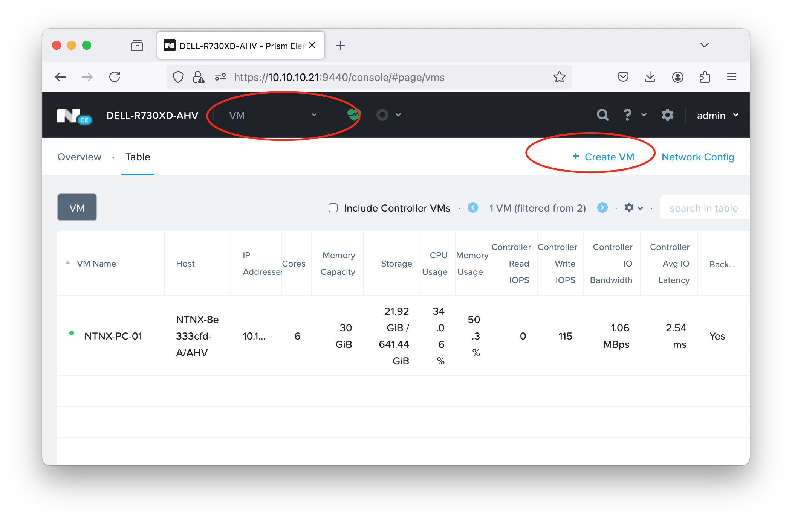

## Enable NDB Server

Requirement to enable Nutanix Database Server (NDB) formally ERA:

- Nutanix Prism
- `NDB-Server.qcow2` disk image, download from [Nutanix Support Download](https://portal.nutanix.com/page/downloads?product=ndb)
    
- Deploy NDB-Server as VM from Prism Element
- Setup & Configure

### Upload disk image to Prism Element

First we need upload disk image to Image Configuration from Settings -> Image Configuration 


then Add Disk look like 


And save, finally image can be used to create Virtual Machine


### Deploy NDB-Server using VM

To deploy NDB-Server very stright-forward, simply create an Virtual Machine from Prism Element 



```bash
#cloud-config
runcmd:
 - configure_static_ip ip=<your-ndb-vm> gateway=<your-subnet-gw> netmask=255.255.255.0 nameserver=8.8.8.8
```