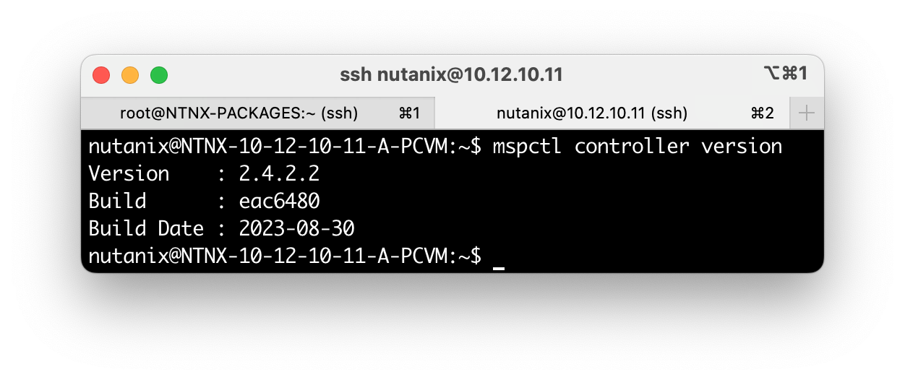
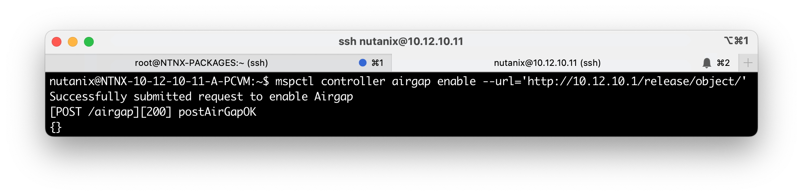

## Enable Object storage (s3)

To enable Nutanix Object Storage (s3) there is two way:

- Online installation
- Offline installation (darksite)

### Offline installation (darksite)

```bash
export LCM_OBJECT=3.6
export LCM_MSP=2.4.2.2
## create folder and give it access to write
sudo mkdir -p /var/www/html/release/object/ && \
sudo chmod -R 777 /var/www/html/**

## extrat to folder target
tar xvf objects-$LCM_OBJECT.tar.gz -C /var/www/html/release/object/
tar xvf lcm_darksite_msp-$LCM_MSP.tar.gz -C /var/www/html/release/object/
tar xvf nutanix_compatibility_bundle.tar.gz -C /var/www/html/release/object/
```

login into prism central then check the `mspctl` version already install with this command:

```bash
mspctl controller version
```

the output look like this:



Setelah itu enable airgap dari mspctl dengan command seperti berikut:

```bash
mspctl controller airgap enable --url='http://10.12.10.1/release/object/'
```

Maka output look like this:

