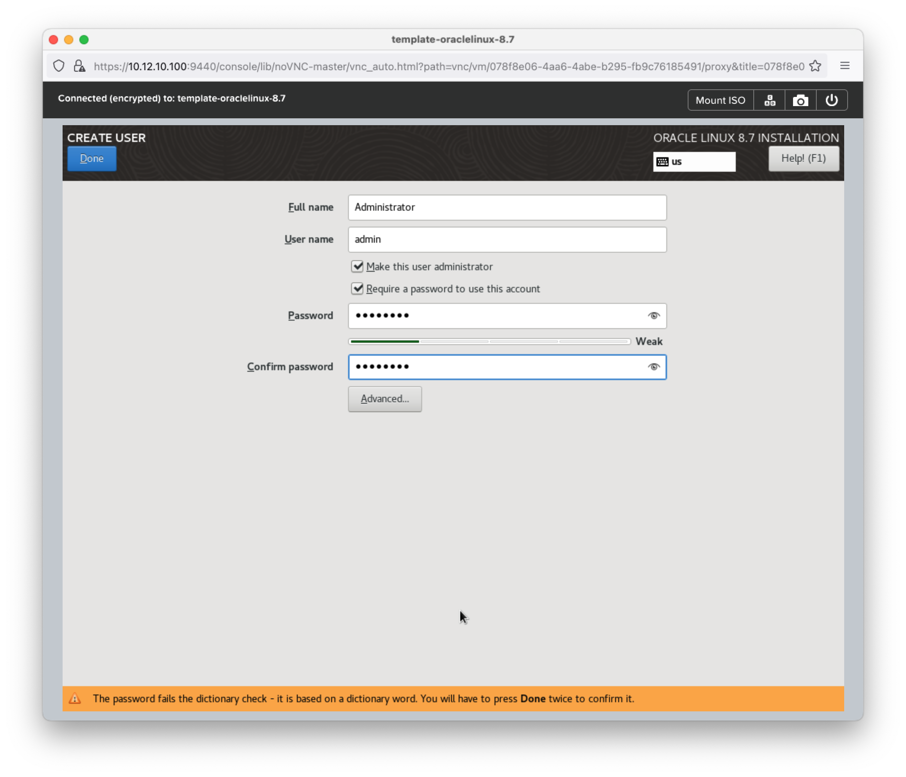

## Create Virtual Machine (VM) template

Untuk membuat Virtual Machine kita membutuhkan ISO image, untuk OS yang akan kita gunakan adalah Oracle Linux v8.7 karena CentOS version 7 & 8 akan end of life (EOL) pada 2024-04 jadi kita ganti default OS menjadi OracleLinux. 

Tahap-tahap untuk membuat Virtual Machine seperti berikut:

- Download iso [OracleLinux](https://yum.oracle.com/oracle-linux-isos.html)
- Create Virtual Machine
- Post Installation
    - Update system seperti `kernel`, `libs` dll
    - Addons commons package seperti `curl`, `wget`, `tmux` dll
    - Setup `/etc/selinux/conf`
    - Setup `/etc/lvm.conf`
- Export image as OVA / `qcow2`
- Import image as disk

## Download ISOs for OracleLinux 8.7

Sekarang kita download dulu Installation Media (ISOs) untuk OracleLinux v8.7 untuk version DVD seperti berikut:


Kita copy link download tersebut, kemudian kita ke Prism Central menudian akses menu [Compute & Storage]() -> [Images]() dan [Add Image]() pilih [URL]() dan masukan link `https://yum.oracle.com/ISOS/OracleLinux/OL8/u7/x86_64/OracleLinux-R8-U7-x86_64-dvd.iso` seperti berikut:


Kemudian [Next](), simpan di [Place image directly on cluster]() dan [Save]() kemudian tunggu sampai image selesai terupload. Jika sudah selesai terdownload hasilnya seperti berikut:


## Create Virtual Machine (VM)

Selanjutnya kita buat Virtual Machine (VM) dengan specifikasi seperti berikut:

```yaml
configuration:
    name: template-oraclelinux-8.7
    description: Template OS Linux with OracleLinux v8.7
    properties:
        cpus: 2
        corePerCpu: 2
        memory: 4
resources:
    disk:
        - type: Disk
          operation: Allocate on Storage Container
          strageContainer: default-storage
          capacity: 50 GiB
          busType: SCSI
        - type: CD-ROM
          operation: Empty CD-ROM
          busType: SATA
    networks:
        - subnet: Primary
          networkConnectionState: Conntected
          assignmentType: Assign with DHCP
```

Untuk membuatnya, kita ke Prism Central kemudian menu [Compute & Storage]() -> [VMs]() dan click button [Add VM]() seperti berikut:


Kemudian click button [Next](), selanjutnya kita pilih disks dan network seperti berikut:


Kemudian click button [Next](), selanjutnya di menu management kita biarkan default seperti berikut:


Lalu click button [Next], maka akan muncul summary vm will be created seperti berikut:


Setelah itu click button [Create VM](), maka hasilnya seperti berikut:


## Deploy OS OracleLinux v8.7

Selanjutnya setelah Virtual Machine terbuat, kita akan deploy OS OracleLinux version 8.7, berikut ada step-by-step nya

Kita nyalakan dulu Virtual Machinenya, dengan cara select VM name `template-oraclelinux-8.7` kemudian pada dropdown [Action]() pilih [Power On]() setelah nyala lalu pilih [Launch console]() seperti berikut:


Maka akan muncul new windows baru seperti berikut:


Kemudian kita mount file ISO dvd `OracleLinux-R8-U7-x86_64-dvd.iso` seperti berikut:


Setelah itu klick [Mount]() dan restart VM. maka sekarang kita akan masuk ke installasi Oracle linux seperti berikut:


Kemudian pilih language seperti berikut:


Selanjutnya pada menu system kita select disk yang akan di install seperti berikut:


kemudian kita format partision seperti berikut:


Setelah itu, kembali ke menu utama, kemudian kita setting Network & Hostname sehingga active seperti berikut:

 


Lalu pada menu software pilih Software Selection pilih saja yang minimum installation seperti berikut:


Kemudian pada menu Localization kita set Time & Date menjadi local `Asia/Jakarta` seperti berikut:


Dan yang terakhir kita setting untuk Root Password dan User Create dengan sepcifikasi seperti berikut:

```yaml
root:
    password: passwordnyaRoot
user:
    name: Adminstrator
    username: admin
    isAdmin: checklist
    requiredPassword: checklist
    password: password
```

Seperti berikut:



Setelah itu lanjutkan installasi dengan click button [Begin Installation]() seperti berikut 


Jika installasi sudah complate, kita click reboot seperti berikut:


## Post Intallation

Setelah installasi ada beberapa hal yang perlu di setting dan configure, tahap pertama kita akan disable dulu selinux dengan meng-edit file `/etc/selinux/config` seperti berikut:

```conf
# set selinux to permissive
SELINUX=permissive
# SELINUX=enforcing
```

Kemudian selanjutnya kita perlu modif disk mapping pada file `/etc/lvm/lvm.conf` seperti berikut:

```conf
# uncommend bellow and set value to 1
use_devicesfile = 1
# use_devicesfile = 0
```

Selanjutnya demi keamanan security biasanya kita juga perlu disable login user as `root` dengan cara edit file `/etc/ssh/sshd_config` seperti berikut:

```ini
# set permit root login to no
PermitRootLogin no
# PermitRootLogin yes
```

Jika sudah sekarang kita reboot system, sekarang setelah di reboot kita check statusnya dengan perintah berikut:

```bash
sestatus
```

Jika dijalankan seperti berikut:

```bash
[admin@template-oraclelinux-8 ~]$ sestatus
SELinux status:                 enabled
SELinuxfs mount:                /sys/fs/selinux
SELinux root directory:         /etc/selinux
Loaded policy name:             targeted
Current mode:                   permissive
Mode from config file:          permissive
Policy MLS status:              enabled
Policy deny_unknown status:     allowed
Memory protection checking:     actual (secure)
Max kernel policy version:      33
```

Jika sudah statusnya menjadi `permissive`, kita bisa lanjutkan ke tahap selanjutnya ada update system dengan perintah berikut:

```bash
dnf update -y
```

Setelah di update, kita bisa install beberapa package commons seperti berikut:

```bash
dnf install -y epel-release && \
dnf install -y htop vim tmux curl wget
```

Kemudian setelah itu kita reboot, dan cleanup package yang sudah tidak digunakan dengan perintah berikut:

```bash
yum clean all
```

## Export image as OVA

Selanjutnya kita akan export image vm tersebut menjadi OVA berextension `.qcow2` pertama kita perlu Turn Off / Power Off dengan perintah 

```bash
sudo poweroff
```

Setelah status vm menjadi Powering Off, sekarang kita bisa click [More]() -> [Export OVA]() seperti berikut:


Dan kita bisa input name ova file dengan `oraclelinux-8.7-20240317.qcow2` seperti berikut:


Hasilnya seperti berikut pada menu [Compute & Storage]() -> [OVAs]() seperti berikut:


Sekarang temen-temen bisa Download file ova tersebut, kemudian simpan di-external storage sebagai backup.

## Export image as disk