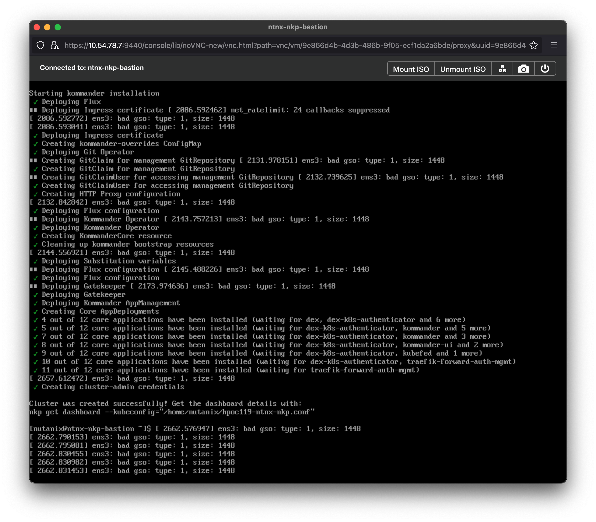

# Nutanix Kubernetes Platform (NKP)

Since middle of 2023, Nutanix discontinue development for Nutanix Kubernetes Engine (NKE) then 2024 will end of support for it. So the next up is we need move to Nutanix Kubernetes Platform (NKP).

## Pre-requirement to enable NKP


To enable NKP is not strigh forward as Nutanix Kubernetes Engine which just one click there is several requirement you should meet, so what the requirement to enable NKP:

- AOS version, atleast `6.8.1`
    - tested `6.5.6.7` with Nutanix CE
    - tested `6.10` with Nutanix CE & Enterpise
- Prism Central, atleast `2024.2` or newer
    - tested `2024.2` with Nutanix CE & Enterprise

- DNS Server ([bind/bind9](https://www.isc.org/bind/), DNS Server on windows, DNS on Network appliance)
- Private Mirror Registry (Recommend using lightweight registry such as [distribution](https://distribution.github.io/distribution/))
- Private Registry ([Nexus OSS](https://www.sonatype.com/products/sonatype-nexus-oss-download), [distribution](https://distribution.github.io/distribution/), [harbor](https://goharbor.io/), etc...)
- Recommended using Bastion VM to provision NKP Komander HOST
- [Download bundle](https://portal.nutanix.com/page/downloads?product=nkp) image, tools, nkp-cli from nutainx portal.

## Private Mirror Registry (airgap)


```bash
mkdir -p certs auth && \
docker run --rm --entrypoint htpasswd xmartlabs/htpasswd -Bbn "admin" "nutanix/4u" | tee auth/htpasswd && \
openssl req -newkey rsa:4096 -nodes -sha256 -keyout certs/domain.key -x509 -days 365 -out certs/domain.crt -subj "/C=ID/ST=Indonesia/L=Jakarta/O=Nutanix/OU=IT/CN=*.nutanix.local" -addext "subjectAltName = DNS:*.nutanix.local"

sudo mkdir -p /mnt/registry && \
sudo docker run -d -p 5000:5000  --restart=always --name DockerRegistry -v /mnt/registry:/var/lib/registry -v `pwd`/auth:/auth -e "REGISTRY_AUTH=htpasswd" -e "REGISTRY_AUTH_HTPASSWD_REALM=Registry Realm" -e REGISTRY_AUTH_HTPASSWD_PATH=/auth/htpasswd -v `pwd`/certs:/certs -e REGISTRY_HTTP_TLS_CERTIFICATE=/certs/domain.crt -e REGISTRY_HTTP_TLS_KEY=/certs/domain.key registry:2

sudo firewall-cmd --zone=public --add-port=5000/tcp --permanent && \
sudo firewall-cmd --reload
```

## Private Registry (Apps images)


File `nginx.conf`

```conf
events {
  worker_connections 1024; 

http {
  client_max_body_size 500M;

  server {
    listen 443 ssl; 
    server_name registry.nutanix.local;

    ssl_certificate /etc/nginx/certs/registry-ca.crt; 
    ssl_certificate_key /etc/nginx/certs/registry-ca.key;

    location / {
        proxy_pass http://localhost:8081; 
        proxy_set_header Host $host; 
        proxy_set_header X-Real-IP $remote_addr;
        proxy_set_header X-Forwarded-For $proxy_add_x_forwarded_for;
        proxy_set_header X-Forwarded-Proto $scheme;
        proxy_set_header X-Forwarded-Host $server_name;
    }

    location /v2 {
        proxy_pass http://localhost:8086; 
        proxy_set_header Host $http_host;
        proxy_set_header X-Real-IP $remote_addr;
        proxy_set_header X-Forwarded-For $proxy_add_x_forwarded_for;
        proxy_set_header X-Forwarded-Proto $scheme;
        proxy_set_header X-Forwarded-Host $server_name;
        proxy_http_version 1.1;
        proxy_set_header X-Forwarded-Ssl on;
        proxy_buffering off;
        proxy_set_header Connection "";
    }

    location /v2/hosted {
        proxy_pass http://localhost:8087; 
        proxy_set_header Host $http_host;
        proxy_set_header X-Real-IP $remote_addr;
        proxy_set_header X-Forwarded-For $proxy_add_x_forwarded_for;
        proxy_set_header X-Forwarded-Proto $scheme;
        proxy_set_header X-Forwarded-Host $server_name;
        proxy_http_version 1.1;
        proxy_set_header X-Forwarded-Ssl on;
        proxy_buffering off;
        proxy_set_header Connection "";
    }
  }
}
```

## DNS Server with bind/bind9

To use DNS Server as software, please install `bind` for RHEL OS Bases and `bind9` for Debian OS Based on your environment either physical or virtual machine. i will like to use **Rocky Linux 9** for this, so please adjust with your own way if you have to use another operating system.

For install bind on Rocky Linux 9 you can use package-manager with this command:

```yum
sudo dnf install bind bind-utils
```

After installing BIND, you'll need to configure it. bind configuration files are located in `/etc/named` directory. The main configuration file is `named.conf`. Please backup it file first:

```bash
sudo cp /etc/named/named.conf /etc/named/named.conf.orig
```

Then edit this file with preferred text editor such as `vim`, `nano` or whatever you like, several property you need to adjust:

```conf
options {
# please comment this 2 lines
#	listen-on port 53 { 0.0.0.0; };
#	listen-on-v6 port 53 { ::1; };
...
```

And than the second file you should edit is `named.rfc1912.zones`, before you edit please backup first as usual:

```bash
sudo cp named.rfc1912.zones named.rfc1912.zones.orig
```

So please add this line to create your own name record:

```ini
zone "nutanix.local" IN {
    type master;
    file "nutanix-local.db";
    allow-update { none; };
    allow-query {any; };
};

zone "20.10.10.in-addr.arpa" IN {
     type master;
     file "nutanix-local.rev";
     allow-update { none; };
     allow-query { any; };
};
```

Replase zone `xx.xx.xx.in-addr.arpa` with your ip address. Next you'll create file zone for hold DNS record for your domain on `/var/named/` directory.

```bash
touch /var/named/nutanix-local.db && \
touch /var/named/nutanix-local.rev
```

Put this line into file `/var/named/nutanix-local.db`:

```ini
$TTL 86400
@ IN SOA ns1.nutanix.local. admin.nutanix.local. (
    2019061800 ;Serial
    3600 ;Refresh
    1800 ;Retry
    604800 ;Expire
    86400 ;Minimum TTL
)

;Name Server Information
@    IN NS ns1.nutanix.local.

;IP for Name Server
ns1 IN A 10.10.20.1
airgap   IN A 10.10.20.2
registry IN A 10.10.20.50
```

Replace the IP for name server with your ip address, than the last one for `/var/named/nutanix-local.rev` file:

```ini
$TTL 86400
@ IN SOA ns1.nutanix.local. admin.nutanix.local. (
    2019061800 ;Serial
    3600 ;Refresh
    1800 ;Retry
    604800 ;Expire
    86400 ;Minimum TTL
)
;Name Server Information
    IN NS ns1.nutanix.local.

;Reverse lookup for Name Server
136 IN PTR ns1.nutanix.local.

;PTR Record IP address to HostName
13 IN PTR nutanix.local.
15 IN PTR airgap.nutanix.local
16 IN PTR registry.nutanix.local
```

When you have all of your files created, you need to ensure that the configuration files and zones are in good working order before you start the bind service again.

```bash
named-checkconf
```

> This will return an empty result if everything is OK.

Check the forward zone:

```bash
named-checkzone registry.nutanix.local /var/named/nutanix-local.db
```

This will return something like this if all is well:

```bash
zone airgap-0/IN: loaded serial 2019061800
OK
```

Finally, check the reverse zone:

```bash
named-checkzone 10.10.20.2 /var/named/nutanix-local.rev
```

Which will return something like this if all is well:

```bash
zone 192.168.1.136/IN: loaded serial 2019061800
OK
```

Assuming that everything looks good, go ahead and start bind and enable it to start on boot:

```bash
sudo systemctl enable --now named
```

Ensure that your firewall allows traffic to the DNS server:

```bash
sudo firewall-cmd --add-service=dns --permanent
sudo firewall-cmd --reload
```

You need to add the DNS server (in our example 10.10.20.1) to each machine that you want to have access to the servers that you added to your local DNS. for global configure you might need set DNS at Nutanix Subnet with ipam configured though Prism look like this:


Then you can test on your virtual machine (VM) with vNic has configure local dns (`10.10.20.1`) so please try 
```bash
ping airgap.nutanix.local
```

If successfuly the domain `airgap.nutanix.local` will resolve like this:


## Prepared Bastion VM

For Bastion VM please use supported Operation System take a look [from documentation](https://portal.nutanix.com/page/documents/details?targetId=Nutanix-Kubernetes-Platform-v2_13:top-nutanix-baseOS-image-c.html) currently only Rocky Linux 9 and Ubuntu 22.04.

I would like to use Rocky Linux 9.5 from scratch, So create VM from Prism Central with this configuration:

```yaml
name: NTNX-NKP-Bastion
resources:
    cpu: 
        core: 2
        thread: 2
    memory: 8 GB
    storage: 
        size: 128 GB
        partisions:
            /: 128 GB
        mode: UEFI
```

After installing Operating System, you should config and install basic package here is following settings need to configure:

1. Set `SELINUX=permissive` on `/etc/selinux/config` file
2. Disable module `rx-gro-hw` using this command:

    ```bash
    sudo ethtool --offload ens3 rx-gro-hw off && \
    sudo nmcli c modify ens3 ethtool.feature-rx-gro-hw off
    ```
3. Install basic package such as curl, wget, tar, zip etc...
    
    ```bash
    yum install -y curl wget tar zip tmux git 
    ```

4. Generate private/public ssh key

    ```bash
    ssh-keygen -t ed25519 -C "dimas.maryanto@nutanix.com" && \
    eval "$(ssh-agent -s)" && \
    ssh-add ~/.ssh/id_ed25519
    ```

5. Install docker ce package

    ```bash
    sudo dnf config-manager --add-repo https://download.docker.com/linux/rhel/docker-ce.repo && \
    sudo dnf -y install docker-ce docker-ce-cli containerd.io && \
    sudo systemctl --now enable docker && \
    sudo usermod -aG docker nutanix
    ```

6. Setting certificate from airgap registry

    ```bash
    # login as root from vm airgap registry then copy the certs into your 
    scp /etc/docker/certs.d/airgap.nutanix.local\:5000/registry.crt nutanix@10.10.20.3:~/
    
    # logout, and than login into bastion vm
    sudo mkdir -p /etc/docker/certs.d/airgap.nutanix.local:5000 && \
    sudo mv registry.crt /etc/docker/certs.d/airgap.nutanix.local\:5000/registry.crt
    ```

7. Login into private registry

    ```bash
    # login with user `admin` and the password of private registry with nke airgap is `nutanix/4u`
    docker login -u admin airgap.nutanix.local:5000
    ```

8. Install kubernetes client

    ```bash
    # install kubectl
    sudo curl -Lo /usr/local/bin/kubectl https://storage.googleapis.com/kubernetes-release/release/$(curl -s https://storage.googleapis.com/kubernetes-release/release/stable.txt)/bin/linux/amd64/kubectl && \
    sudo chmod +x /usr/local/bin/kubectl && \
    kubectl version --client

    # install helm
    sudo curl https://raw.githubusercontent.com/helm/helm/main/scripts/get-helm-3 | bash && \
    helm version
    ```

9. [Download bundle](https://portal.nutanix.com/page/downloads?product=nkp) `NKP Airgapped Bundle` from the nutanix portal:

    

    After download extract it using this command:

    ```bash
    tar -zxvf nkp-air-gapped-bundle* && \
    cd $(ls -1 -d nkp-v2* | tail -1 | sort -r)

    # install nkp-cli
    sudo mv cli/nkp /usr/local/bin/ && \
    sudo chmod +x /usr/local/bin/nkp && \
    nkp version
    ```

10. Load the `nkp-image-builder` and `nkp-bootstrap` from `NKP Airgap Bundle`:

    ```bash
    docker load -i konvoy-bootstrap-image* && \
    docker load -i nkp-image-builder-image*
    ```

11. Publish container to private registry used by NKP

    ```bash
    export REGISTRY_URL='https://airgap.nutanix.local:5000'
    export REGISTRY_USERNAME='admin'
    export REGISTRY_PASSWORD='nutanix/4u'
    export REGISTRY_CACERT='/etc/docker/certs.d/airgap.nutanix.local:5000/registry.crt'

    nkp push bundle --bundle ./container-images/konvoy-image-bundle*.tar --to-registry=${REGISTRY_URL} --to-registry-username=${REGISTRY_USERNAME} --to-registry-password=${REGISTRY_PASSWORD} --to-registry-ca-cert-file=${REGISTRY_CACERT} && \    
    nkp push bundle --bundle ./container-images/kommander-image-bundle*.tar --to-registry=${REGISTRY_URL} --to-registry-username=${REGISTRY_USERNAME} --to-registry-password=${REGISTRY_PASSWORD} --to-registry-ca-cert-file=${REGISTRY_CACERT} && \
    nkp push bundle --bundle ./container-images/nkp-catalog-applications-image-bundle*.tar --to-registry=${REGISTRY_URL} --to-registry-username=${REGISTRY_USERNAME} --to-registry-password=${REGISTRY_PASSWORD} --to-registry-ca-cert-file=${REGISTRY_CACERT}
    ```

    After finished publish the images bundle, you can see at private registry look like this:

    

## Deploy NKP Kommander node

To deploying NKP first, you should create kommander host with command `nkp create cluster nutanix`. So basicly we have 2 option which is TUI (Terminal UI) / Prompt-based installation and CLI installation. At this time i will deploy cli installation because that's more easies and fully customize your cluster configuration.

Because this cluster only for starter lisences so the configuration of nodes i'll created is

```yaml
master:
    size: 1
    cpu: 8
    ram: 16
worker:
    size: 3
    cpus: 8
    ram: 16
```

So here is the command to execute that configuration

```bash
export IMAGE="nkp-rocky-9.5-release-1.30.5-20241204003513.qcow2"
export NUTANIX_USER="<your-pc-username>"
export NUTANIX_PASSWORD="<your-pc-password>"
export NUTANIX_ENDPOINT="https://<your-pc-ipaddress|domain>:9440"
export CLUSTER_NAME="<your-pe-cluster-name>"
export STORAGE_CONTAINER="<your-pe-storage-container>"
export SSH_PUBLIC_KEY="<your-ssh-public-key-location>" # ex: /home/user/.ssh/id_ed25519.pub
export REGISTRY_CACERT="/etc/docker/certs.d/airgap.nutanix.local:5000/registry.crt"
export REGISTRY_URL="https://airgap.nutanix.local:5000"
export REGISTRY_USERNAME="admin"
export REGISTRY_PASSWORD="nutanix/4u"
export NKP_CLUSTER_NAME="nkp-kommander-<unique-name>" # ex: nkp-kommander-hpoc1020
export SUBNET="<your-network-subnet-name>" # ex: mgnt.ntnx.ipam.local
export CONTROLPLANE_VIP="<your-vip-controlplane>" # ex: 10.10.20.5
export METALLB_IP_RANGE="<your-lb-ip-start>-<your-lb-ip-end>" # ex: 10.10.20.6-10.10.20.9

nkp create cluster nutanix \
    --cluster-name=${NKP_CLUSTER_NAME} \
    --control-plane-prism-element-cluster=${CLUSTER_NAME} \
    --worker-prism-element-cluster=${CLUSTER_NAME} \
    --control-plane-subnets=${SUBNET} \
    --worker-subnets=${SUBNET} \
    --control-plane-endpoint-ip=${CONTROLPLANE_VIP} \
    --csi-storage-container=${STORAGE_CONTAINER} \
    --endpoint=${NUTANIX_ENDPOINT} \
    --control-plane-vm-image=${IMAGE} \
    --worker-vm-image=${IMAGE} \
    --registry-mirror-url=${REGISTRY_URL} \
    --registry-mirror-username=${REGISTRY_USERNAME} \
    --registry-mirror-password=${REGISTRY_PASSWORD} \
    --registry-mirror-cacert=${REGISTRY_CACERT} \
    --kubernetes-service-load-balancer-ip-range=${METALLB_IP_RANGE} \
    --ssh-public-key-file=${SSH_PUBLIC_KEY} \
    --control-plane-replicas 1 \
    --control-plane-cores-per-vcpu 1 \
    --control-plane-vcpus 8 \
    --control-plane-memory 16 \
    --worker-replicas 3 \
    --worker-vcpus 8 \
    --worker-cores-per-vcpu 1 \
    --worker-memory 16 \
    --insecure \
    --self-managed
```

If everything is okay no issue at all, you can see this message



And you can access the dashboard of NKP using this command

```bash
export KUBECONFIG=./nkp-kommander-hpoc1020.conf
nkp open dashboard
```


Please open the url on the browser, and you can see look like this:

