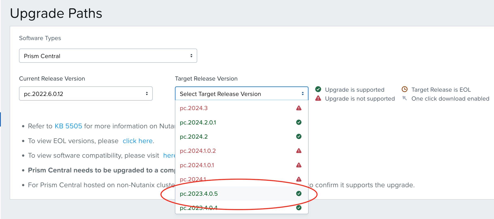
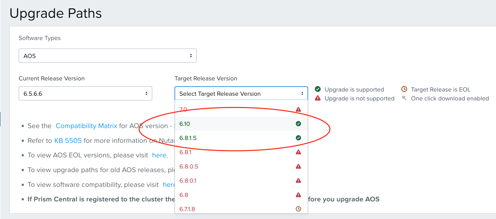
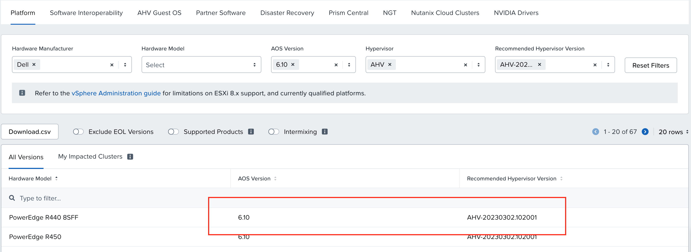
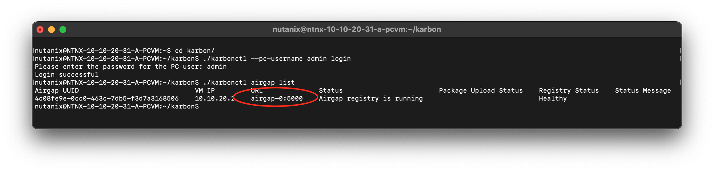
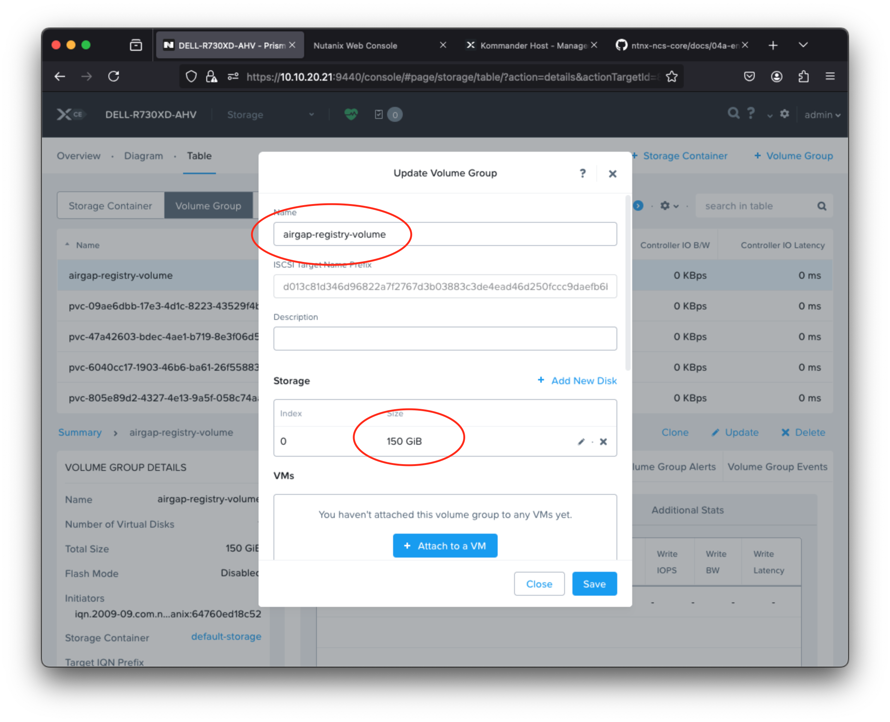

# Nutanix Kubernetes Platform (NKP)

Since middle of 2023, Nutanix discontinue development for Nutanix Kubernetes Engine (NKE) then 2024 will end of support for it. So the next up is we need move to Nutanix Kubernetes Platform (NKP).

To enable NKP is not strigh forward as Nutanix Kubernetes Engine which just one click there is several requirement you should meet, so what the requirement to enable NKP:

- AOS version, atleast `6.8.1`
    - tested `6.10` at Nutanix CE & Enterpise
- Prism Central, atleast `2024.2` or newer
    - tested `2024.1` at Nutanix Enterprise
    - tested `2024.2` at Nutanix CE & Enterprise

There 2 method for installation Nutanix Kubernetes Platform:

1. Online Installation (you may experience some failures `error: coz maximum pull request from docker.io`)
    - Required stable & high speed internet access
    - Recommended using Bastion VM to provision NKP Kommander HOST

2. Offline Installation (Recommended)
    - DNS Server ([bind/bind9](https://www.isc.org/bind/), DNS Server on windows, DNS on Network appliance)
    - Private Registry ([Nexus OSS](https://www.sonatype.com/products/sonatype-nexus-oss-download), [distribution](https://distribution.github.io/distribution/), [harbor](https://goharbor.io/), etc...)
    - Recommended using Bastion VM to provision NKP Komander HOST
    - [Download bundle](https://portal.nutanix.com/page/downloads?product=nkp) image, tools, nkp-cli from nutainx portal.

So this article we will goes through step by step for *Enablement Nutanix Kubernetes Platform (NKP) with Offline Mode / Airgap*

## Upgrade Infrastructure

As i mentioned previously there is several requirement to enable Nutanix Kubernetes Platform from instrastructure perspective is need to up to date of Nutanix Cloud Platform Software (AOS & Prism Central). **If you have done it before you can skip this step**, if not please upgrade Prism Central first with following upgrade path:

Example how if currently the Prism Central has `2022.6.x` deployed so please find the way to upgrade to `2024.2` or later, So if you see Upgrade path from nutanix portal roadmap is you need to upgrade to `2023.x` then `2024.2` look like this



After Prism Central successfully upgrade, then you can upgrade the AOS version. If you currently running `6.5.6.6` then you can upgrade to `6.10`



Also you need to upgrade AHV version to `AHV-20230302.102001`



Please consult to us, if you have any trouble

## Private registry (airgap)

Private container registry is one of the most important components for enablement Nutanix Kubernetes Platform with airgap mode (offline / without internet). So private registry we gonna using is build-in NKE has previously enabled

Please refer to [this doc](./04a-enable-nke.md) to enable NKE airgap

But if you have another private container registry such as Nexus OSS, Harbor, distribution.io. It's also possible use to.

So here, i'm already enabled the NKE airgap look like this:



Next, please increase size of volume group for `airgap-registry-volume` at least `150GB` through The Prism:



Then you need configure DNS for `airgap-0` domain, by default NKE airgap configure at `/etc/hosts` level so this mean only node/vm have contain `airgap-0` on file `/etc/hosts` can pointing to the ip address of NKE airgap, if not have it then it's will not able to accessed.

The solution has 2 method, using network appliance or if you can't reach the network device also you can use software based such as bind for RHEL based / bind9 for debian based.

## DNS Server with bind/bind9

To use DNS Server as software, please install `bind` for RHEL OS Bases and `bind9` for Debian OS Based on your environment either physical or virtual machine. i will like to use **Rocky Linux 9** for this, so please adjust with your own way if you have to use another operating system.

For install bind on Rocky Linux 9 you can use package-manager with this command:

```yum
sudo dnf install bind bind-utils
```

After installing BIND, you'll need to configure it. bind configuration files are located in `/etc/named` directory. The main configuration file is `named.conf`. Please backup it file first:

```bash
sudo cp /etc/named/named.conf /etc/named/named.conf.orig
```

Then edit this file with preferred text editor such as `vim`, `nano` or whatever you like, several property you need to adjust:

```conf
options {
# please comment this 2 lines
#	listen-on port 53 { 0.0.0.0; };
#	listen-on-v6 port 53 { ::1; };
...
```

And than the second file you should edit is `named.rfc1912.zones`, before you edit please backup first as usual:

```bash
sudo cp named.rfc1912.zones named.rfc1912.zones.orig
```

So please add this line to create your own name record:

```ini
zone "airgap-0" IN {
    type master;
    file "airgap-0.db";
    allow-update { none; };
    allow-query {any; };
};

zone "20.10.10.in-addr.arpa" IN {
     type master;
     file "airgap-0.rev";
     allow-update { none; };
     allow-query { any; };
};
```

Replase zone `xx.xx.xx.in-addr.arpa` with your ip address. Next you'll create file zone for hold DNS record for your domain on `/var/named/` directory.

```bash
touch /var/named/airgap-0.db && \
touch /var/named/airgap-0.rev
```

Put this line into file `/var/named/airgap-0.db`:

```ini
$TTL 86400
@ IN SOA ns1.airgap-0. admin.airgap-0. (
    2019061800 ;Serial
    3600 ;Refresh
    1800 ;Retry
    604800 ;Expire
    86400 ;Minimum TTL
)

;Name Server Information
@    IN NS ns1.airgap-0.

;IP for Name Server
ns1 IN A 10.10.20.1
@   IN A 10.10.20.2
```

Replace the IP for name server with your ip address, than the last one for `/var/named/airgap-0.rev` file:

```ini
$TTL 86400
@ IN SOA ns1.airgap-0. admin.airgap-0. (
    2019061800 ;Serial
    3600 ;Refresh
    1800 ;Retry
    604800 ;Expire
    86400 ;Minimum TTL
)
;Name Server Information
    IN NS ns1.airgap-0.

;Reverse lookup for Name Server
136 IN PTR ns1.airgap-0.

;PTR Record IP address to HostName
13 IN PTR airgap-0.
```

When you have all of your files created, you need to ensure that the configuration files and zones are in good working order before you start the bind service again.

```bash
named-checkconf
```

> This will return an empty result if everything is OK.

Check the forward zone:

```bash
named-checkzone airgap-0 /var/named/airgap-0.db
```

This will return something like this if all is well:

```bash
zone airgap-0/IN: loaded serial 2019061800
OK
```

Finally, check the reverse zone:

```bash
named-checkzone 10.10.20.2 /var/named/airgap-0.rev
```

Which will return something like this if all is well:

```bash
zone 192.168.1.136/IN: loaded serial 2019061800
OK
```

Assuming that everything looks good, go ahead and start bind and enable it to start on boot:

```bash
sudo systemctl enable --now named
```

Ensure that your firewall allows traffic to the DNS server:

```bash
sudo firewall-cmd --add-service=dns --permanent
sudo firewall-cmd --reload
```

You need to add the DNS server (in our example 10.10.20.3) to each machine that you want to have access to the servers that you added to your local DNS. for global configure you might need set DNS at Nutanix Subnet with ipam configured though Prism look like this:


Then you can test on your virtual machine (VM) with vNic has configure local dns (`10.10.20.1`) so please try 
```bash
ping airgap-0
```

If successfuly the domain `airgap-0` will resolve like this:


## Prepared Bastion VM

For Bastion VM please use supported Operation System take a look [from documentation](https://portal.nutanix.com/page/documents/details?targetId=Nutanix-Kubernetes-Platform-v2_13:top-nutanix-baseOS-image-c.html) currently only Rocky Linux 9 and Ubuntu 22.04.

I would like to use Rocky Linux 9.5 from scratch, So create VM from Prism Central with this configuration:

```yaml
name: NTNX-NKP-Bastion
resources:
    cpu: 
        core: 2
        thread: 2
    memory: 8 GB
    storage: 
        size: 128 GB
        partisions:
            /: 128 GB
        mode: UEFI
```

After installing Operating System, you should config and install basic package here is following settings need to configure:

1. Set `SELINUX=permissive` on `/etc/selinux/config` file
2. Disable module `rx-gro-hw` using this command:

    ```bash
    ethtool --offload ens3 rx-gro-hw off && \
    nmcli c modify ens3 ethtool.feature-rx-gro-hw off
    ```
3. Install basic package such as curl, wget, tar, zip etc...
    
    ```bash
    yum install -y curl wget tar zip tmux git 
    ```

4. Generate private/public ssh key

    ```bash
    ssh-keygen -t ed25519 -C "dimas.maryanto@nutanix.com" && \
    eval "$(ssh-agent -s)" && \
    ssh-add ~/.ssh/id_ed25519
    ```

5. Install docker ce package

    ```bash
    dnf config-manager --add-repo https://download.docker.com/linux/rhel/docker-ce.repo && \
    dnf -y install docker-ce docker-ce-cli containerd.io && \
    systemctl --now enable docker && \
    usermod -aG docker nutanix
    ```

6. Setting certificate from airgap registry

    ```bash
    # login from vm airgap registry then copy the certs into your 
    scp /etc/docker/certs.d/airgap-0\:5000/registry.crt nutanix@10.10.20.3:~/
    
    # logout, and than login into bastion vm
    sudo mkdir -p /etc/docker/certs.d/airgap-0:5000 && \
    sudo mv registry.crt /etc/docker/certs.d/airgap-0\:5000/registry.crt
    ```

7. Login into private registry

    ```bash
    # login with user `admin` and the password of private registry with nke airgap is `nutanix/4u`
    docker login -u admin airgap-0:5000
    ```

8. 