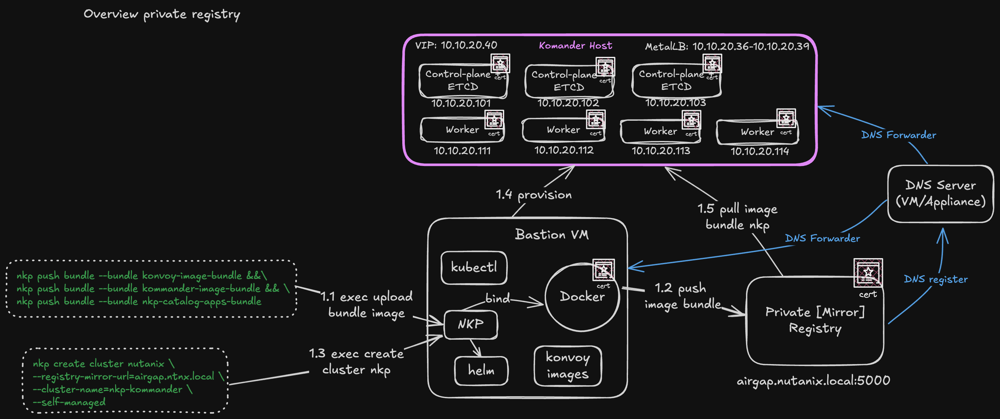
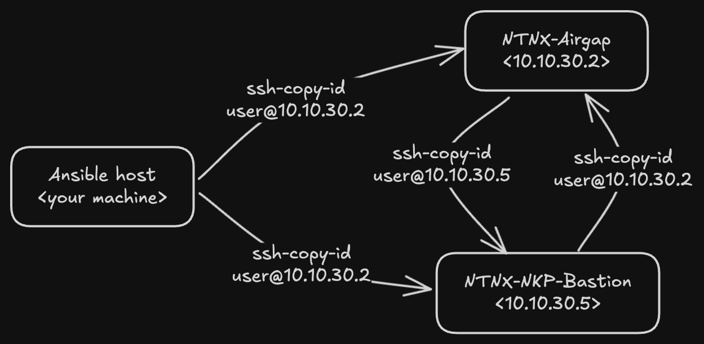
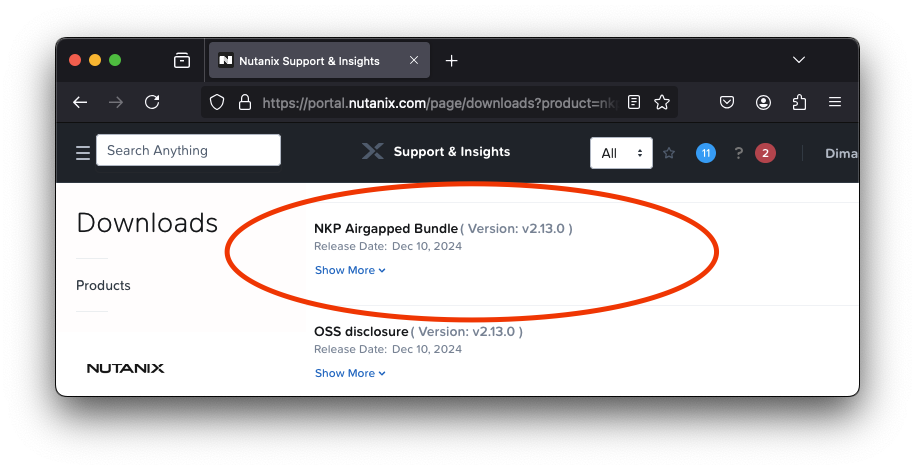
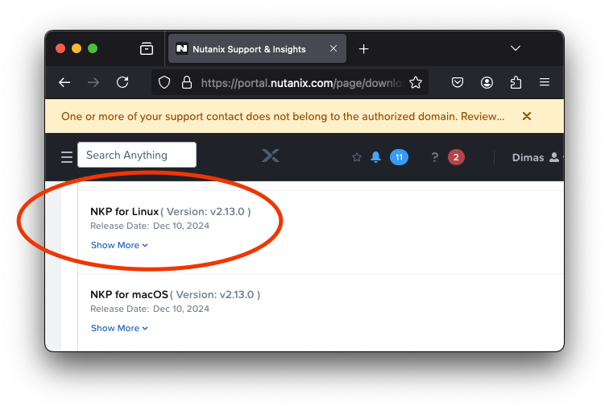
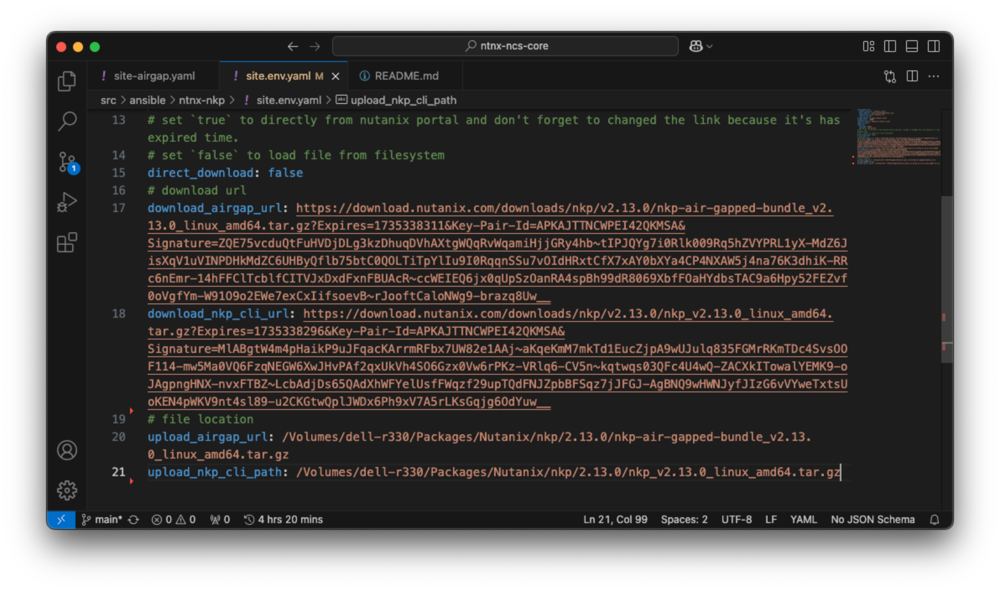

# Provision NKP deployment with Ansible playbook

This playbook will provision NKP base installation with airgap method, look like this architecture



Pertama yang perlu kita siapkan adalah minimum 2 Virtual Machine dengan spesifikasi seperti berikut:

```yaml
airgap:
    name: NTNX-Airgap
    os: ['RockyLinux 9.x', 'Ubuntu 24.xx', 'OracleLinux 9.x'] # pilih salah satu
    network: 
        ip_address: '10.10.30.2' # please adjust with your network configuration
        subnet: '10.10.30.0/24'
        gateway: '10.10.30.254'
        dns_server: ['8.8.8.8', '8.8.4.4']
    resources:
        cpus:
            cores: 2
            thread: 2
        memory: 8
        storage: 250 # atleast 250 GB storage capacity
bastion:
    name: NTNX-NKP-Bastion
    os: ['RockyLinux 9.x', 'Ubuntu 24.xx'] # pilih salah satu
    network: 
        ip_address: '10.10.30.5' # please adjust with your network configuration
        subnet: '10.10.30.0/24'
        gateway: '10.10.30.254'
        dns_server: ['8.8.8.8', '8.8.4.4']
    resources:
        cpus:
            cores: 2
            thread: 4
        memory: 8
        storage: 128 # atleast 128 GB storage capacity
```

Pertama kita clone dulu repository ini, dengan perintah berikut:

```bash
git clone https://github.com/dimMaryanto93/ntnx-ncs-core.git --depth 1 && \
cd ntnx-ncs-core/src/ansible ## masuk ke folder ansible
```

Setelah itu kita perlu install dependency dengan menggunakan perintah berikut:

```bash
ansible-galaxy role install -r requirements.yaml --force && \
ansible-galaxy collection install -r requirements.yaml --force
```

## Prepare your host inventory

Please edit the `inventory.ini` for host `nkp-airgap` and `nkp-bastion` with your own configuration vm's. After you modify inventory host, you will need authenticate those vm's with this command each machine

```bash
ssh-copy-id <username>@<host-machine>
```



Here is you should do

```bash
# on your machine
💻 ~ ➡ ssh-copy-id user@10.10.30.2
Number of key(s) added:        1

Now try logging into the machine, with:   "ssh 'user@10.10.30.2'"
and check to make sure that only the key(s) you wanted were added.

💻 ~ ➡ ssh-copy-id user@10.10.30.5
Number of key(s) added:        1

Now try logging into the machine, with:   "ssh 'user@10.10.30.5'"
and check to make sure that only the key(s) you wanted were added.
```

Execute ansible file `site-commons.yaml` with `ansible-playbook` command:

```bash
ansible-playbook -i inventory.ini --ask-become-pass ntnx-nkp/site-commons.yaml
```

After basic package installed and generate ssh keygen is created so you need copy the ssh public key to each machine

```bash
# login into airgap machine
💻 ~ ➡ ssh user@10.10.30.2
[user@NTNX-Airgap ~]$ ssh-copy-id user@10.10.30.5
Number of key(s) added: 1

Now try logging into the machine, with:   "ssh 'user@10.10.30.5'"
and check to make sure that only the key(s) you wanted were added.
[user@NTNX-Airgap ~]$ logout
Connection to 10.10.30.2 closed.

# login into bastion machine
💻 ~ ➡ ssh user@10.10.30.5
[user@NTNX-NKP-Bastion ~]$ ssh-copy-id user@10.10.30.2
/usr/bin/ssh-copy-id: INFO: Source of key(s) to be installed: "/home/user/.ssh/id_ed25519.pub"
Number of key(s) added: 1

Now try logging into the machine, with:   "ssh 'user@10.10.30.2'"
and check to make sure that only the key(s) you wanted were added.
```

## Prepare you environment variable

Please modify file `site.env.yaml` for value of the propery

- `direct_download`, if you decide for download directly nutanix portal please set the value is `true` and get url set into property `download_airgap_url`, `download_nkp_cli_url` else if you set `false` please set value of property `upload_airgap_url`, `upload_nkp_cli_path`
- `download_airgap_url`, please fill this property with download url with this component
    
- `download_nkp_cli_url`, please fill this property with download url with this compenent
    

The final look like this:

